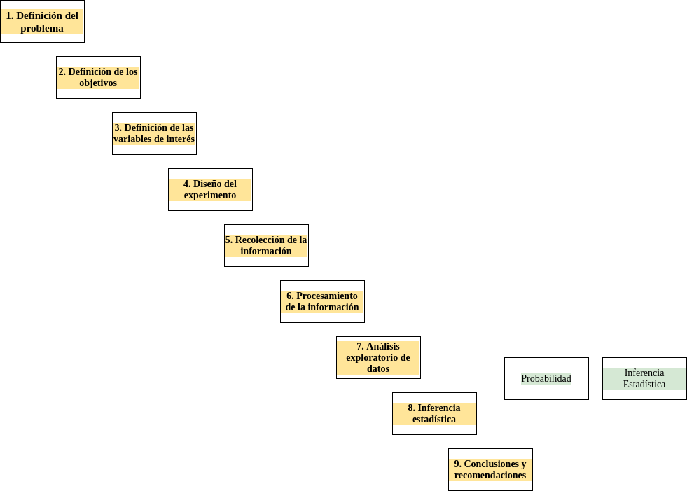

```{r setup, include=FALSE}
knitr::opts_chunk$set(echo = TRUE, comment = NA)
library(summarytools)


c1 ="#FF7F00"  # naranja - color primario 
c2 ="#034A94"  # azul oscuro - color secundario
c3 ="#0EB0C6"  # azul claro - color terciario
c4 ="#686868"  # gris - color texto
```


```{r, echo=FALSE, out.width="100%", fig.align = "center"}
knitr::include_graphics("img/banner_presentacion.png")
```


</br></br>

En esta unidad se abordaran las principales herramientas estadísticas para el análisis de datos, a traves de los conceptos principales y  las herramientas estadísticas para  resumir y analizar datos, además de los códigos en R que nos permiten hacerlos


Utilizaremos los pasos de la Metodología Estadística como estrategia para ubicar los métodos estadísticos empleados en este curso :


<br/>

##### 1. **Definición del problema**
##### 2. **Definición de los objetivos**
##### 3. **Definición de las variables de interés**
##### 4. **Diseño del experimento**
##### 5. **Recolección de la información**
##### 6. **Procesamiento de los datos**
##### 7. <span style="color:#FF7F00">**Análisis descriptivo o exploratorio de datos**</span>
#####    <span style="color:#C9C9C9">**Probabilidad**</span>
#####    <span style="color:#C9C9C9">**Variable aleatoria**</span>
##### 8. <span style="color:#FF7F00">**Inferencia estadística**</span>
##### 9. **Conclusiones y recomendaciones**

<br/><br/>

**Nota** : 

La Métodologa Estadística está basada en el método científico que corresponde a un procedimiento iterativo de aprendizaje, el cual está compuesto por las siguientes etapas: 

1. Formulación de una hipótesis, 
2. Observación, 
3. Análisis de información y prueba de la hipótesis, interpretación de resultados y decisión.

<br/><br/>

Es necesario tener en cuenta al realizar un análisis exploratorio de datos (paso 7 de la Metodología Estadística) los pasos previos a este, como son la definición del problema objeto de estudio, cual será nuestra meta (objetivos) o finalidad del estudio. Que variables debemos recoger para poder cumplir con el objetivo propuesto, además del diseño del experimento, es decir como se requiere recolectar la infomación, cuanta información, las fuentes y los medios para su procesamiento.

Despues de tener claridad sobre los pasos anteriores (1 a 6) se empieza el análisis expleratorio de datos. Con él realizamos una primera aproximación a los objetivos planteados. 


```{r, echo=FALSE, out.width="100%", fig.align = "center"}
# 
```
