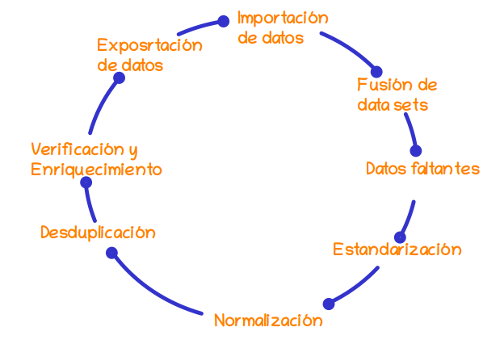

```{r setup, include=FALSE}
knitr::opts_chunk$set(echo = TRUE, message = FALSE, warning = FALSE, comment = NA)

# install.packages('gtools')
# install.packages("TeachingSampling")

#load library
library(gtools)
library(TeachingSampling)
library(readr)
library(paqueteMET)

c1="#FF7F00"
c2="#034A94"
c3="#0EB0C6"
c4="#686868"

data(vivienda_faltantes)

```


</br></br>

La importación de los datos es una de las etapas importantes del proceso para el análisis de datos, que depende del formato y la fuente de los datos. Esta etapa forma parte del ciclo la limpieza de los datos o Data Cleansing.

<!-- ======================================================================= -->


```{r, echo=FALSE, out.width="70%", fig.align = "center"}

```


<center>
**Figura : 1.1 ** Ciclo de limpieza de datos  <br/>
<sub> Tomado de Data Cleaning In 5 Easy Steps + Examples </sub>
</center>

</br></br>

En R se puede importar los datos de diferentes formas: 

</br>

### <span style="color:#034a94">**1. Utilizando el menú RStudio**</span> 

|
|:------------------------|:--------------------------------------------|
| * **formato .txt**      | *File/Import Dataset/From Text (base)*      |
| * **formato .csv**      | *File/Import Dataset/From text (base)*      |
| * **formato .xlsx**     | *File/Import Dataset/ From Excel*           |
| * **formato .dat**      | *File/Import Dataset/ From SPSS*            |
| * **formato .sas7bdat** | *File/Import Dataset/ From SAS*             |
| * **formato .dta**      |  *File/Import Dataset/ From Stata*          |
|                         |                                             |
</br></br>

### <span style="color:#034a94">**2. Utilizando el paquete Rcmdr y RcomdrMisc**</span>

Este paquete activa una interfas de R que trabaja con menus y ventanas con un proceso semejante  al proceso anterior 

</br>

<div class="content-box-gray">
### <span style="color:#686868">**Nota**</span> 

Los anteriores caso implican que tengamos la base de datos descargada en una carpeta de nuestro PC
</div>

</br></br>

### <span style="color:#034a94">**3. Utilizando API y token desde un repositorio externo**</span>

Podemos importar la base de datos de un repositorio que maneje API que es un permiso a traves de un token. En este caso debemos solicitar el token e instalar el paquete RSocrata

Por ejemplo

Instalación de paquetes requeridos

```{r, eval=FALSE }
# install.packages("RSocrata", dependencies = TRUE)   # instalación de paquete RSocrata
 library(RSocrata)    # llamado de libreria
 # token <- "zxMsD6eXc0zlEMryRGW87Hwrz"  # token
 # Colombia <- read.socrata("https://www.datos.gov.co/resource/gt2j-8ykr.json", app_token = token) # lectura 
```

Este proceso tarde unos minutos pues  la base es grande

Para guardar el archivo en mi PC, el formarto RDS es menos pesado En ete caso se guarda el archivo con el nombre de *Colombia.RDS* en la carpeta *data/*

```{r, eval=FALSE}
saveRDS(Colombia, file = "data/Colombia23.RDS") 
```

</br></br>

### <span style="color:#034a94">**4. Desde un paquete de R instalado**</span> 

Podemos trabajar con Dataset disponible en los paquetes de R. Para ello solo utilizamos la función data

```{r}
data(iris)  # data set iris
data(cars)  # data set cars
```

</br></br>

<div class="content-box-gray">
### <span style="color:#686868">**Nota**</span> 

Ahora si tengo un archivo en mi PC, puedo utilizar la siguinte función para conocer la ruta donde esta  el archivo  y luego copiando la ruta obtenida con Ctrl+C, 

```{r, eval=FALSE, warning=FALSE, message=FALSE}
file.choose()
```

En mi caso se genera la ruta "data/Colombia.RDS"


```{r, eval=FALSE}
Colombia<- readRDS("data/Colombia23.RDS")
```

</div>

</br></br>

R permite importar datos en diferentes formatos :

**Tabla 1.1** : formatos de datos importados en R  

| Formato    | libreria R       | código                                                         |
|:-----------|:-----------------|:---------------------------------------------------------------|
| .texto     | library(readr)   | datos <- read_delim("ruta_del_archivo/datos.txt", delim = ",") |
| .csv       | library(readr)   | datos <- read.csv("datos.csv")                                 |
| .xlsx      | library(readxl)  | datos <- read_excel("datos.xlsx", sheet = "hoja1")             |
| .json      | library(jsonlite)| datos <- fromJSON("datos.json")                                |
| .stata     | library(haven)   |  datos_stata <- read_dta("datos_stata.dta")                    |
| .spss      | library(haven)   | datos_spss <- read_sav("datos_spss.sav")                       |
| .sas       | library(haven)   | datos_sas <- read_sas("datos_sas.sas7bdat")                    |
|            |                  |                                                                |ç


</br></br> 

### <span style="color:#FF7F00">**Retos**</span> 

<div class="content-box-gray">
* Importe la base de datos a  la fecha de Covid-19
```{r, eval=FALSE }
install.packages("RSocrata", dependencies = TRUE)   # instalación de paquete RSocrata
library(RSocrata)    # llamado de libreria
token <- "zxMsD6eXc0zlEMryRGW87Hwrz"  # token - cada uno puede obtener su token en la pagina de Datos Abiertos Colombia
Colombia <- read.socrata("https://www.datos.gov.co/resource/gt2j-8ykr.json", app_token = token) # lectura 
```
</div>

<div class="content-box-gray">
* Importe la base de datos del dataset :  `flights` del paquete `nycflights13` y explore sus principales caracteristicas

</div>

