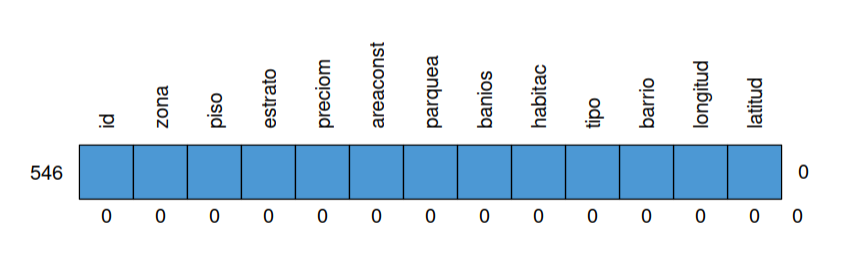
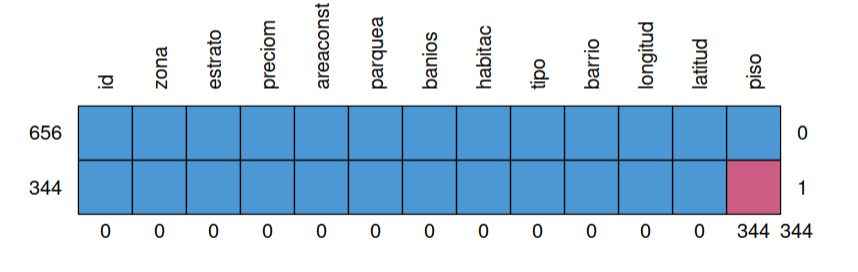
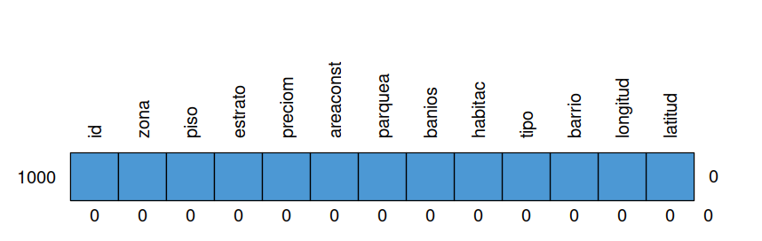

```{r setup, include=FALSE}
knitr::opts_chunk$set(echo = TRUE, message = FALSE, warning = FALSE, comment = NA)

# install.packages('gtools')
# install.packages("TeachingSampling")

#load library
library(gtools)
library(TeachingSampling)
library(readr)
library(paqueteMET)

c1="#FF7F00"
c2="#034A94"
c3="#0EB0C6"
c4="#686868"

library(paqueteMET)
data("vivienda_faltantes")

```

</br></br>

<!-- ======================================================================= -->

Una de las tareas más importante al realizar un proyecto de Ciencia de Datos corresponde a la preparación de los datos (Limpieza de datos o data cleaning) que posteriormente van a permitir el modelamiento adecuado. 

Este ciclo comprende :

* Importación de los datos 
* Fusión de datos
* Datos faltantes
* Estandarización
* Normalización
* Elinación de registros duplicados
* Verificación y enrequecimiento
* Exportación de los datos

</br></br>

Al importar una base de datos que está conformada por una matriz con n filas o registros  y m columnas o variables se presentan problemas relacionados con:

* Datos faltantes (NA)
* Reemplazar los datos faltantes - imputación
* Datos extraños o  atípicos
* Necesidad de estandarizar los valores con el fin varias variables sean comparables (una misma escala)
* Construir nuevas variables a partir de las contenidas en la base
* Cambiar el formato de una variable 
* Aumentar los registros contenidos en dos bases
* Agregar variables contenidas en dos bases

</br></br>

A contunuación trataremos algunos de estos temas que nos permitan tratar y dejar lista la base de datos de interes para empezar el análisis de datos

</br></br>


## <span style="color:#034a94">**Datos faltantes**

El tratamiento de datos faltantes es un aspecto crítico en Ciencia de Datos, ya que ellos pueden afectar de manera significativa la calidad y validez de los análisis y modelos que realicemos. Acontinuación se presentan algunas estrategias comunes para manejar los datos faltantes:

</br>

### <span style="color:#034a94">**1. Eliminacion de los registros  o filas**</span>

Si los **datos faltantes** son pocos en comparación con el tamaño total del conjunto de datos, una estrategia es eliminar los registros o filas que contienen datos faltantes. Sin embargo, esta estrategia puede llevar a una pérdida de información si los datos faltantes son sistemáticos o si se eliminan muchas observaciones en comparación con el tamaño de la base de datos.

</br>

### <span style="color:#034a94">**2. Imputación de valores** 

La imputación implica estimar y reemplazar los valores faltantes con valores razonables. Esto se puede realizar  de diferentes maneras, como :

</br>

### <span style="color:#034a94">**3. Reemplazar los valores faltantes** 

Se reemplazan los datos faltantes por la media o la mediana en el caso de variables numéricas  o por el valor más frecuente de la variable correspondiente (moda), en el caso de las variables cualitativas. 

</br>

### <span style="color:#034a94">**4. Utilizar técnicas más avanzadas**

Los valores faltantes pueden ser reemplazados por valores obtenidos a a partir modelos, donde se construyen para estimar los valores faltantes de manera predictiva.

</br>

### <span style="color:#034a94">**5. Tratamiento de datos faltantes como una categoría** 

En el caso de variables categóricas o cualitativas sus valores faltantes se pueden encontrar a partir del modelamiento la subbase con registros completos 

los datos faltantes pueden tener un significado propio y no deben ser imputados ni eliminados. En lugar de eso, puedes considerar tratar los datos faltantes como una categoría adicional en el análisis o modelo.

</br>

### <span style="color:#034a94">**6. Técnicas avanzadas de imputación**  

Existen métodos Aavanzados para imputar datos faltantes, como la imputación múltiple (multiple imputation) y la imputación basada en modelos de aprendizaje automático. Estos enfoques generan múltiples conjuntos de datos imputados y tienen en cuenta la incertidumbre asociada con la imputación.

</br>

Es importante evaluar cuidadosamente el patrón y la naturaleza de los datos faltantes antes de decidir qué estrategia utilizar. Además, es fundamental tener en cuenta que los método de imputación introduce incertidumbre y puede afectar los resultados de los análisis o modelos. Por lo tanto, es recomendable documentar y tener en cuenta el proceso de imputación en el análisis y la interpretación de los resultados.

</br></br>


### <span style="color:#FF7F00">**Ejemplo**

A partir de la base de datos vivienda_faltantes contenida en paqueteMET, se plantera examinar una muestra de ella de tamaño 1000 x 13 que se puede obtener con el siguiente código :


```{r}
library(paqueteMET)
library(dplyr)
data("vivienda_faltantes")
set.seed(123)
datosNA<-sample_n(vivienda_faltantes, 1000)
str(datosNA)
```

<br/>

Como se observa con la función  `str()`  obtenemos una visualización del tamaño de la base de datos, las variables que la conforman y el tipo de variables y una muesrta de los primeros valores.


Existen diferentes formas de visualizar los datos faltantes 

```{r}
faltantes <- colSums(is.na(datosNA))
faltantes
```

Esta función muestra el número total de datos faltantes por variable

<br/>


```{r, message=FALSE, warning=FALSE}
# install.packages("naniar")
library(naniar)
gg_miss_var(datosNA)
```

En esta gráfica podemos visualizar que las viables piso y parquea presentan datos faltantes, la primera al rededor de 340 y la segunda un poco mas de 200 datos faltantes.

</br></br>


```{r}
# install.packages("mice")
library(mice)
grafico <-md.pattern(datosNA, rotate.names = TRUE)

```

En la gráfica generada por la función `md.pattern()` del paquete `mice`  representa la base de datos, se observa que 546 registros tienen informaciçon completa (sin datos faltantes), a 246 registros tiene datos faltantes en la variable piso, que a 110 registros les hace falta información en la variables parqueadero  y a 98 registros les hace falta la información en dos variables (parqueadero y piso)

</br></br>

Ahora iniciaremos por la primera opción que consiste en elimitar todos los registros que contenga datos faltantes (NA) con la función `na.omit()`  y lo verificamos


```{r, eval=FALSE}
# install.packages("mice")
library(mice)
datosSINA <- na.omit(datosNA)
grafico <-md.pattern(datosSINA, rotate.names = TRUE)
```

```{r, echo=FALSE, out.width="60%", fig.align = "center"}

```


</br></br>

# **Imputación**

Si no queremos eliminar los registros que contiene datos faltantes dado que perdemos un gran porcentaje de la información, entoces recurrimos a reemplazar estos valores, primero calculado el valor por el cual realizaremos el reemplazo, en este primer caso puede ser que se trate de falta de información o que los propietarios entendieron que no debian colocar nada, pues su vivienda no posee parqueadero. En otros casos es posible que se trate de un dato faltante real y se deba reeplazar por la media por ejemplo

El caso de reemplazar el NA por cero procederemos así:

```{r}
datosNA$parquea[is.na(datosNA$parquea)] <- 0
grafico <-md.pattern(datosNA, rotate.names = TRUE)
```

</br>

En el caso de reemplazar el NA por el valor correspondiente a la media se asigna este valor de la siguiente manera:

```{r, eval=FALSE}
# Calcula la media de la variable "parquea"
media_parquea <- mean(datosNA$parquea, na.rm = TRUE)
datosNA$parquea[is.na(datosNA$parquea)] <- media_parquea
grafico <-md.pattern(datosNA, rotate.names = TRUE)

```


```{r, echo=FALSE, out.width="70%", fig.align = "center"}

```
</br></br>


```{r, eval=FALSE}
# install.packages("DescTools")
library(DescTools)
moda_piso <- Mode(datosNA$piso, na.rm = TRUE)
datosNA$piso[is.na(datosNA$piso)] <- moda_piso
grafico <-md.pattern(datosNA, rotate.names = TRUE)
```


```{r, echo=FALSE, out.width="70%", fig.align = "center"}

```

<br/>

Las otras tecnicas la iremos incorporando en las siguientes unidades

