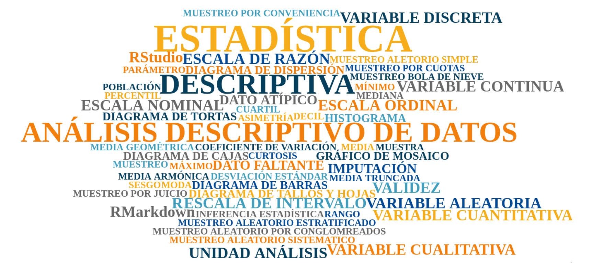

```{r setup, include=FALSE}
knitr::opts_chunk$set(echo = TRUE, comment = NA)

c1 ="#FF7F00"  # naranja - color primario 
c2 ="#034A94"  # azul oscuro - color secundario
c3 ="#0EB0C6"  # azul claro - color terciario
c4 ="#686868"  # gris - color texto

# <span style="color:#FF7F00"> **naranja**</span> 
# <span style="color:#034A94"> **azul oscuro**</span>
# <span style="color:#0EB0C6"> **azul claro**</span>  

```


<br/>


```{r, echo=FALSE, out.width="100%", fig.align = "center"}

```

La  **ESTADÍSTICA** está conformadas por múltiples conceptos que abordaremos a los largo de esta unidad o por lo menos haremos enfasis en los más importantes

