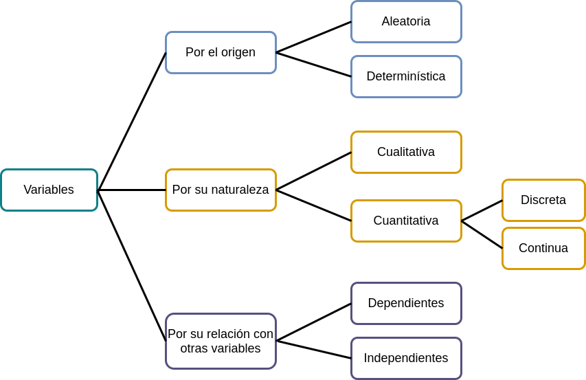
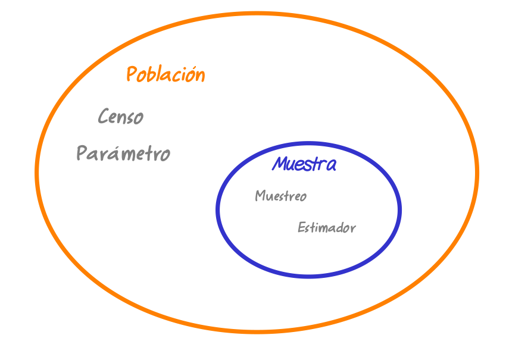

```{r setup, include=FALSE}
knitr::opts_chunk$set(echo = TRUE, comment = NA)

c1 ="#FF7F00"  # naranja - color primario 
c2 ="#034A94"  # azul oscuro - color secundario
c3 ="#0EB0C6"  # azul claro - color terciario
c4 ="#686868"  # gris - color texto

# <span style="color:#FF7F00"> **naranja**</span> 
# <span style="color:#034A94"> **azul oscuro**</span>
# <span style="color:#0EB0C6"> **azul claro**</span>  

```


</br></br><br/>

# <span style="color:#034A94">**Estadística**</span>

```{r, echo=FALSE, out.width="100%", fig.align = "center"}
knitr::include_graphics("img/statistics1.png")
```
Tomada de : pixabay.com

</br></br>


## **¿Qué es?**  

</br>

**ESTADÍSTICA** es una ciencia, la cual se encarga de suministrar diferentes métodos y procedimientos para recoger, clasificar, resumir, hallar regularidades y analizar los datos; así como de realizar inferencias a partir de ellos, con la finalidad de ayudar a la toma de decisiones y en su caso, formular predicciones.

</br>

La estadística surge como la herramienta ideal para cercar los efectos de incertidumbre inherentes a la gran mayoría de procesos biológicos, químicos, industriales y de comportamiento humano, en donde predominan los efectos del azar y la incertidumbre.

En su desarrollo histórico la estadística ha superado las siguientes etapas:

* Conteo de poblaciones, riquezas y recursos naturales. Antes de Cristo – XVII.

* Cuantificación de probabilidades de éxito en los juegos de azar. Siglo XVIII.

* Optimización de la producción agrícola. Siglo XIX.

* Herramienta de apoyo en el desarrollo científico y tecnológico en todas las áreas del conocimiento.

</br>

El objetivo de la Estadística se centra en brindar apoyo en la transformación de datos en información. Teniendo en cuenta que los datos son sólo la representación numérica o categórica de una medición y la información es la integración de esos datos y factores del contexto para generar un criterio suficiente en la toma de decisiones.

> "Llegará el día en el que el pensamiento estadístico será una condición tan necesaria para la convivencia eficiente como la capacidad de leer y escribir". 
>
> --H.G. Wells --

</br></br>


## **¿Donde aplicarla?**  

La estadística es una ciencia transversal a las diversas disciplinas del conocimiento, como, por ejemplo: finanzas, ingeniería, salud, economía, contabilidad, mercadeo, sociología y ciencias, entre muchas otras.  Algunos ejemplos de su aplicación son:

* Finanzas: se realizan estudios para estimar el riesgo que tiene una inversión o el préstamo de dinero por parte de una entidad bancaria.

* Ingeniería: la estadística permite realizar el control de calidad de productos.

* Salud: es utilizada para realizar múltiples investigaciones que generan mejores tratamientos para las enfermedades.

* Economía: la estadística permite estudiar los determinantes del desempleo o el crecimiento económico en una región.

Así mismo, si nos detuviéramos a analizar cada una de las disciplinas en las que se desenvuelve nuestras actividades diarias, encontraríamos ejemplos donde se tiene la necesidad de contar con información que nos permita tomar decisiones confiables.


</br></br>

### **Actividad**

De acuerdo con tu área de profesión, identifica alguna situación o actividad donde sea necesaria la Estadística.


</br></br></br>


# **Conceptos**

</br></br>

##  **Análisis descriptivo**    

La estadística descriptiva comprende los métodos para organizar, resumir y presentar datos de manera informativa. Su fin es únicamente exploratorio y se limita a describir lo observado en una población o muestra.

Su objetivo es la exploración sin restricciones de los datos en busca de regularidades interesantes. Las conclusiones solo se aplican a los individuos y a las circunstancias para los cuales se obtuvieron los datos, además son informales y se basan en lo que se observa en los datos.

</br>

<span style="color:#FF7F00">**Ejemplo**</span>

Descripción de la producción mensual de café durante el año 2016 través de una tabla o gráfico lineal o de barras, además se puede comparar las variaciones porcentuales del año 2016 respecto al 2015.

</br></br>

## **Inferencia estadística**  

La estadística inferencial consiste en el proceso inductivo que permite inferir o generalizar a toda la población características observadas en una muestra. 

Su objetivo es responder a preguntas concretas que se plantearon antes de la obtención de los datos. Las conclusiones se aplican a un grupo más amplio de individuos o situaciones, son formales y se hace explicito el grado de confianza que se tienen sobre ellas.

</br>

<span style="color:#FF7F00">**Ejemplo**</span>

A partir de una muestra aleatoria regional en el Valle del Cauca de 550 estudiantes se encuentra que el 45% de ellos están cursando primaria, esta proporción se generaliza a toda la población del departamento.

</br></br>

## **Validez**  

Es posible hacer uso de los pasos de una persona para medir la distancia entre dos puntos. ¿Este sería confiable? 

La respuesta a esta pregunta es **NO**. Dado que los pasos de una persona pueden ser diferentes a los de otra persona debido a la diferencia en sus tallas. Las mediciones realizadas por diferentes personas genera una variabilidad extra inherente al sujeto que realiza la medición, afectando así los datos que se obtienen a partir de este.

La mejor alternativa en este caso es hacer uso de instrumentos calibrados, estandarizados o validados, como un flexómetro, rueda métrica, etc. De tal manera que, si la medición se toma varias veces con el mismo instrumento, esta no varié, de una a
otra medición.


</br>

Es el grado en que la medición puede generalizarse a otras situaciones no medidas, depende en gran proporción de la conformación adecuada de la muestra a través de métodos estadísticos.

</br>

<span style="color:#FF7F00">**Ejemplo**</span>

Un estudio desea concluir sobre el ingreso promedio por vivienda de las familias de la ciudad Cali. Si en el estudio solo se encuestan familias que pertenecen al estrato 1 ¿Se podría concluir que el ingreso promedio calculado sobre ese grupo representa el promedio de ingresos para toda la ciudad?

La respuesta es **NO**, la información obtenida a partir de ese estudio no podrá ser generalizada a toda la población dado que sólo se tuvo en cuenta cierto sector de la ciudad y se ignoraron las familias del estrato 2 al 6.


<br/></br>

## **Unidad de análisis**  

Son los elementos u objetos que tiene información sobre el fenómeno que se estudia, es decir aquellos objetos descritos por un conjunto de datos. Los individuos pueden ser personas, pero también pueden ser animales o cosas.

<br/>

<span style="color:#FF7F00">**Ejemplo**</span>

Si se estudia el peso promedio de los estudiantes en una carrera de la universidad, cada uno de los estudiantes son los individuos.

</br></br>

## **Variable**  

Corresponde a características tomadas de la unidad de análisis.  Las variables se pueden clasificar según su origen, naturaleza o relación con otras variables :

<br/>

```{r, echo=FALSE, out.width="100%", fig.align = "center"}

```
Fuente: construcción propia

</br></br>

**Por su origen** : Una variable es aleatoria cuando los valores resultantes de una medición no se pueden predecir de antemano. Podría decirse que ese valor se desconoce por completo. Si antes de medir, puede predecirse el valor que tendrá la variable, entonces se dice que ésta tiene carácter determinístico.

</br></br>

**Por su naturaleza** : Si procede de un conteo (discreta) y si procede de una medición  (continua).

</br></br>

**Por su relación con otras variables** : Si su comportamiento está relacionado o depende de otra variable se califica como dependiente en caso contrario se clasifica como independiente 


Inicialmente nos concentraremos en la clasificación de las variables debido a su naturaleza :

</br></br>

### **Variables cualitativas** 

Sus valores (categorías o modalidades) no se pueden asociar naturalmente a un número, ni se pueden hacer operaciones matemáticas con ellos. 

</br></br>

### **Variables cuantitativas** 

Toman valores numéricos y se pueden hacer operaciones matemáticas con ellos. Estas se clasifican en dos grupos: continuas y discretas.


</br></br></br>

### **Variables continuas** 

Las variables continuas pueden tomar cualquier valor real dentro de un intervalo, en general proceden de la medición de características.

</br>

<span style="color:#FF7F00">**Ejemplos**</span>

* Estatura de los estudiantes de este curso, 
* Temperaturas registradas al medio día durante el mes pasado, 
* Peso de los profesores de estadística


</br></br>

### **Variables discretas**

Las variables discretas sólo toman valores enteros, por lo general proceden el conteo y empiezan por número de ...

</br>

<span style="color:#FF7F00">**Ejemplos**</span>

* Número de hijos, 
* Número de carros, 
* Número de materias matriculas este semestre


</br></br>

### **Escalas de medición**


```{r, echo=FALSE, out.width="70%", fig.align = "center"}
knitr::include_graphics("img/escalas.png")
```
Fuente: construcción propia

</br></br>

**Nominal** : En las variables con escala de medición nominal, sus valores no se pueden ordenar, es decir que no existe una forma particular para ordenar sus valores. | Religión (católico, cristiano, evangélico, agnóstico), 

</br>

<span style="color:#FF7F00">**Ejemplos**</span>

* Género (masculino,  femenino),  
* Nacionalidad (colombiano, venezolano, ecuatoriano, ...) 

</br></br>

**Ordinal** : En las variables con escala de medición ordinal, sus valores tienen un orden natural o se puede identificar un orden jerárquico entre sus valores o categorías. 

</br>

<span style="color:#FF7F00">**Ejemplos**</span>

* Nivel educativo (primaria, secundaria, universitario, especialización, maestría, doctorado, postdoctorado), 
* Estrato socioeconómico (1, 2, 3, 4, 5, 6) 
* Nivel de estrés ( bajo, medio, alto)

</br></br>

**De intervalo** : En estas variables el cero (0) es un valor arbitrario, no implica la ausencia de una
característica.

</br>

<span style="color:#FF7F00">**Ejemplo**</span>

Temperatura de cero grados no indica que no hay temperatura, sólo es un valor que toma la variable para esa escala.

</br></br>

**De razón** : El cero (0) refleja ausencia de la característica, implica la ausencia de una característica.

</br>

<span style="color:#FF7F00">**Ejemplos**</span>

* Número de hijos 
* Salario 
* Ventas mesuales

<br/><br/>

## **Población**  

Es el conjunto de todos los elementos de interés en un estudio, sobre los cuales se desea información y hacia los cuales se extenderán las conclusiones.

</br>

<span style="color:#FF7F00">**Ejemplo**</span>

El total de estudiantes matriculados en la universidad o el total de la población en la ciudad de Cali.


</br></br>

## **Muestra**  

Es cualquier subconjunto representativo de la población, sobre el que se realizan los estudios para obtener conclusiones acerca de las características de la población.

<br/>

<span style="color:#FF7F00">**Ejemplo**</span>

100 estudiantes seleccionados del total de matriculados en la universidad o 500 personas seleccionadas de la población de Cali.


```{r, echo=FALSE, out.width="70%", fig.align = "center"}

```
Fuente: construcción propia

</br></br>

## **Parámetro**  

Indicador estadístico calculado teniendo en cuenta los elementos de la población se denominan parámetros y son denotados de manera general como $\theta$.

<br/>

<span style="color:#FF7F00">**Ejemplos**</span>

* Edad promedio de todos los estudiantes matriculados en la universidad ($\mu$) 
* La proporción de personas con empleo formal en la ciudad de Cali ($p$).

Para el cálculo de ambos parámetros se debe contar con la información del ceso correspondiente

</br></br>

## **Estimador**  

Indicador estadístico calculado teniendo en cuenta los elementos de la muestra, de manera general se representan por $\widehat{\theta}$.


<br/>

<span style="color:#FF7F00">**Ejemplos**</span>

* Edad promedio de una muestra de 100 estudiantes matriculados en la universidad ($\bar{x}$). 
* Proporción muestral de personas con empleo de una muestra de 500 personas de la ciudad de Cali ($\widehat{p}$).

En este caso los valores corresponden a  valores obtenidos de una muestra. 


</br></br>

## **Tipos de muestreo**  

Para seleccionar los datos podemos utilizar muestreos probabilísticos o no probabilísticos que se dividen en diferentes tipos como se indica en el siguiente diagrama

<br/><br/>

## **Muestreos probabilísticos**

El muestreo probabilístico es un método de selección de la muestra en el que métodos que garantizan una selección aleatoria de los elementos de la muestra, es decir que cada elemento de la población tienen igual probabilidad de ser elegido dentro de una muestra. Esto garantiza además de representatividad de los elementos seleccionados con respecto a las características de la población, independencia entre los valores seleccionados, los cuales permiten características deseables al momento de realizar inferencias sobre los resultados obtenidos

<br/><br/>

## **Muestreos no probabilísticos**

El muestreo no probabilístico (o muestreo no aleatorio) es la técnica de muestreo donde los elementos son elegidos a juicio del investigador. No se conoce la probabilidad con la que se puede seleccionar a cada individuo.


```{r, echo=FALSE, out.width="70%", fig.align = "center"}
knitr::include_graphics("img/muestreos.png")
```

Fuente: construcción propia
<br/><br/>

**Nota** 

Los muestreos por internet utilizando redes sociales se clasifica dentro de los muestreos no probabilísticos descritos

