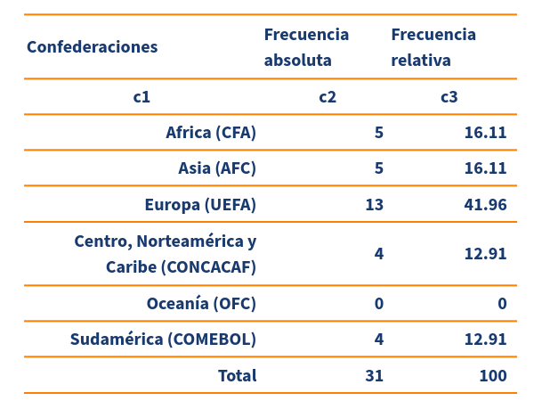

```{r setup, include=FALSE}
knitr::opts_chunk$set(echo = TRUE)
```
<br/><br/><br/>

# **Variables cualitativas**

</br>

## **Escala nominal**

</br>

Las distribuciones de frecuencia o también llamadas tablas de frecuencia nos sirven para agrupar los datos y tener una idea mas clara de sus características. Estan conformadas por una primera columna donde se presentan  las clases (filas de la tabla) que corresponden con las categorías observadas de una variable cualitativa. En caso de tener la variable una escala de medición nominal, es decisión del investigador la ubicación u ordenamiento de las categorías dentro de la tabla de frecuencias. Por el contrario para las variables en escala ordinal se realiza el ordenamiento siguiendo la jerarquía de las categorías 


</br></br>


Para las variables cualitativas en escala nominal, las tabla posee 3 columnas :

|      |                                                                                                                     |
|:-----|:--------------------------------------------------------------------------------------------------------------------|
|c1    | los diferentes valores que toma la variable.                                                                        |
|c2    | $f_{i}$ : frecuencia absoluta que consiste en el conteo para cada uno de los valores distintos que toma la variable.|
|c3    | $h_{i}$ : frecuencia relativa que corresponde al porcentaje la cantidad de datos para cada los valores              |

</br>

<span style="color:#FF7F00">**Ejemplo**</span>

</br></br>

Tabla 1. Distribución del número de equipos participantes en Quatar 2022 por confederaciones
```{r, echo=FALSE, out.width="70%", fig.align = "center"}

```
Fuente : [wikipedia](https://es.wikipedia.org/wiki/Clasificaci%C3%B3n_para_la_Copa_Mundial_de_F%C3%BAtbol_de_2022)

</br></br>

La información resumida nos muestra de manera clara la participación de cada confederación en el torneo, destacandose la UEFA con un 41.96% de participación.

</br></br>

## **Escala ordinal**

</br>

Otro caso correspondiente a las variables cualitativas en escala ordinal, para lo cual  se agregan dos nuevas columas además de las descritas en el ejemplo anterior.

|      |                                                                                                                  |
|:-----|:-----------------------------------------------------------------------------------------------------------------|
|c4    | $F_{i}$ : frecuencia absoluta acumulada que consiste en el conteo de los casos menores o iguales al nivel correspondiente.|
|c5    | $H_{i}$ : frecuencia relativa acumulada que corresponde al porcentaje acumulado hasta el nivel correspondiente.|

</br>

<span style="color:#FF7F00">**Ejemplo**</span>

Tabla 2 : Nivel de satisfación usarios aereolinea, servicio de alimentación/bebidas a bordo
```{r, echo=FALSE, out.width="80%", fig.align = "center"}
knitr::include_graphics("img/tabla2.png")
```
Fuente : [kaggle](https://www.kaggle.com/datasets/alfredoblancas/airline-passenger-satisfaction-spanish?resource=download)

</br>

En ella se destaca que un 33.5% de los clientes tienen una perseción negativa sobre el servicio de alimentación abordo de las naves de la aerolinea, mientras que un 66.5% tiene una persecicón de bueno a excelente.

</br></br></br>

# **Variables cuantitativas**


Para el caso de las variables cualitativas es necesario agrupar los valores en intervalos siguiendo los siguientes criterios :

* Si se desea realizar comparaciones con otra información clasificada en tablas de frecuencia, debemos realizar las mismas divisiones
* Si la variable tiene criterios de división previamente establecidos se realizan las mismas divisiones. Este es el caso de variables como el salario (divisiones en funcion de los salarios mínimos vigentes). La variable edad tiene rangos estableciodos por ciclos de vida. 
* En caso de no aplicar alguno de los criterios anteriores se pueden construir intervalos de igual tamaño (por defecto los programas estadísticos siguen este criterio)


Tambien es importante determinar el número de intervalos a constuir ($k$), para los cuales nos podemos basar en el criterio de Sturges : $k=1+3.3 log(n)$.  


</br></br>

<span style="color:#FF7F00">**Ejemplo**</span>

La tabla para los tiempos empleados por las corredoras de la categoría abieta muestra una mayor concentración en el intervalo 2, comprendido entre 45 y 60 minutos, las cuales representan un 45.6% del grupo


Además de las colunmas descritas anteriormente se adicionan :

* El número del intervalo
* Los límites inferior y superior de los intervalos
* La marca de clase que determina la mitad de cada intervalo y que representará los números contenidos en el intervalo

</br></br>

Tabla 3 : Tiempo de carrera categoria juvenil mujeres, carera La Luz 2022
```{r, echo=FALSE, out.width="80%", fig.align = "center"}
knitr::include_graphics("img/tabla4.png")
```
Fuente :[juanchocorrelon](https://www.athlinks.com/event/212331/results/Event/1031677/Results)


<br/><br/>
