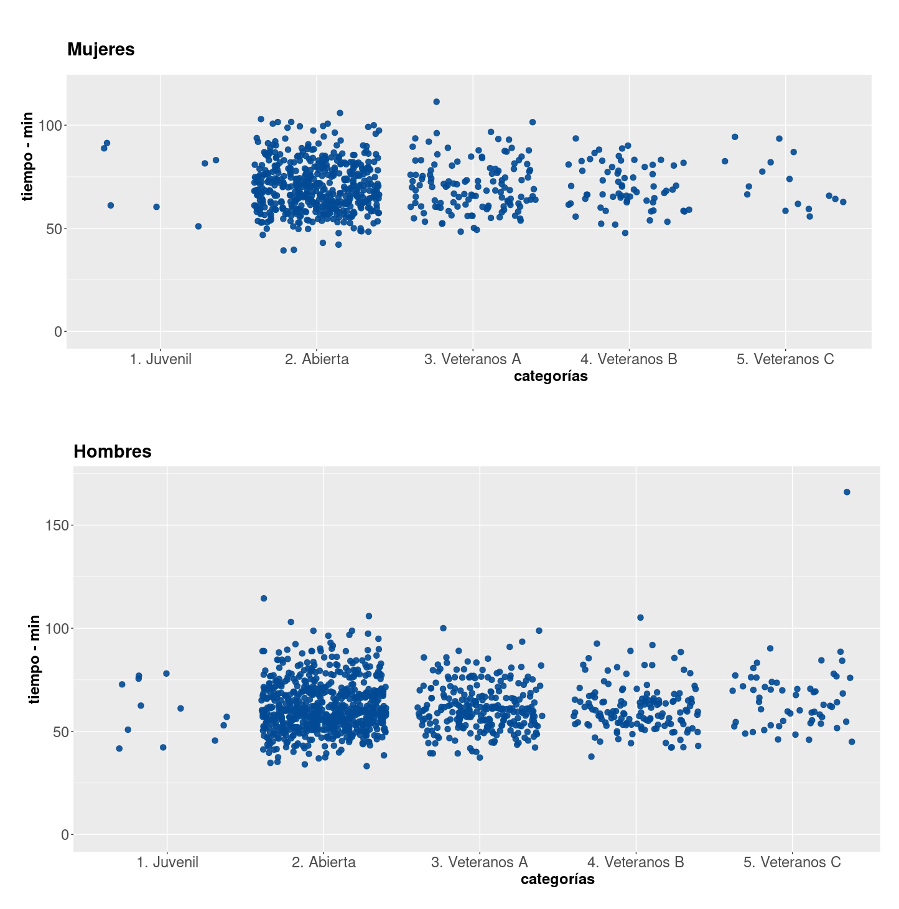
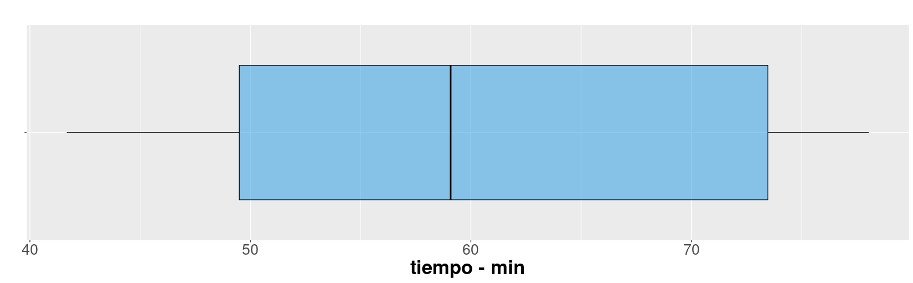
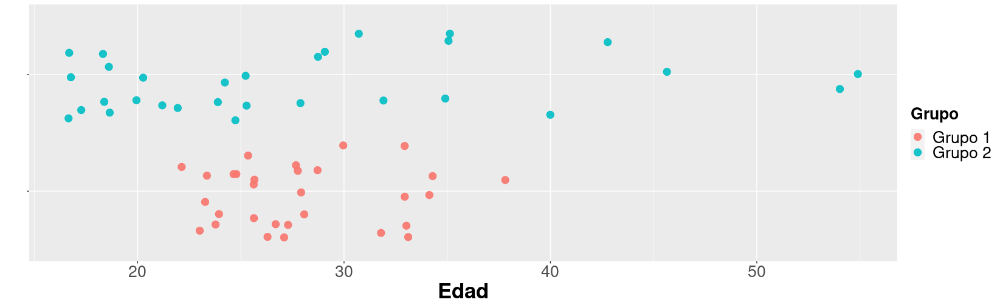

```{r setup, include=FALSE}
knitr::opts_chunk$set(echo = TRUE)
```


</br></br>

Cuando nos subimos a un auto observamos un tablero con muchos indicadores que permiten al conductor validar el estado del vehículo. Todos los podemos visualizar al tiempo con el fin de darnos una idea del nivel de combustible, la temperatura, el estado de la batería, si alguna puerta esta abierta, la velocidad a la que se viaja, entre otros.

</br>

Al igual que la situación anterior cuando nos enfrentamos a una análisis de datos, requerimos resumirlos en indicadores, tablas y gráficos que nos permitan un fácil análisis de ellos.

</br>

Para los datos cuantitativos se pueden utilizar tablas de frecuencia para identificando el valor con mayor frecuencia (más repetido), indicador que se denomina **MODA**.

</br>

Para las variable cuantitativas existen una serie de indicadores que caracterizan y facilitan su análisis como son :

* Indicadores de posición
* Indicadores de centro
* Indicadores de dispersión o variabilidad
* Indicadores de forma

</br>

Iniciaremos con los indicadores de posición

</br></br>

<!-- ======================================================================= -->

# **De posición**

Los indicadores de posición permiten identificar la posición relativa de un valor con respecto al grupo. Para entender el concepto se utiliza información correspondiente a una carrera de 10 kilómetros.


</br></br>

Figura 1 : Carrera 
```{r, echo=FALSE, out.width="100%", fig.align = "center"}
knitr::include_graphics("img/carrera.jpg")
```
<center>Tomada de : pixabay.com</center>

</br></br>

En octubre de 2022 se corrió la carrera de la Luz, contando con 1922 participantes en 10 categorías por edad y sexo. ( Juvenil, Abierta, Veteranos A, Veteranos B y Veteranos C para hombre y mujeres). 

El siguiente gráfico de puntos representa los tiempos alcanzados por los participantes por categoría y sexo empleados para recorrer los 10 kilómetros de la competencia.

</br></br>

Gráfico 1 : Tiempos por categoría y sexo  - Carrera La Luz 2022
```{r, echo=FALSE, out.width="100%", fig.align = "center"}

```
<center>Fuente :[juanchocorrelon](https://www.athlinks.com/event/212331/results/Event/1031677/Results)</center>

</br></br>

Para un participante que llega a la meta es interesante poder comparar el resultado obtenido con respecto al grupo. La respuesta está en los indicadores de posición.

</br></br>

## **Percentiles**

Los percentiles corresponden a 99 valores que dividen los datos en cien partes de igual porcentaje ($P_1$, $P_2$, $P_3$, $P_4$, $\dots$, $P_{99}$).

</br>

<span style="color:#FF7F00">**Ejemplo**</span>

Para ilustrar el concepto, pensemos en que participamos de una carrera. El percentil dará cuenta de mi posición dentro del grupo. 

Ahora supongamos que dos corredores que se llamarán `María` y `Carlos` participaron en la carrera. `María` ocupó un lugar correspondiente al percentil 40 ($P_{40}$)  y `Carlos` ocupó el puesto que corresponde al percentil 30 ($P_{30}$). Podríamos afirmar que a Carlos obtuvo un mejor resultado que María ?. La respuesta es que se debe tener más información para poderlo afirmar

El resultado depende del grupo en que participó cada uno de los corredores. Por ejemplo supongamos que :

`Carlos` tiene 55 años y pertenece por tanto a la categoría *Veteranos B* (corredores con edad entre los 50 y 60 años), mientras que `María` tiene 25 años y por tanto pertenece a la categoría *Abierta* (18 a 39 años).

Veamos en cada caso que tiempo marcaron los corredores con un punto en su respectivas categorías:

Gráfica  2 : Tiempos y posiciones de Carlos y María
```{r, echo=FALSE, out.width="100%", fig.align = "center"}
knitr::include_graphics("img/Rplotcarrera.png")
```
<center>Fuente : [juanchocorrelon](https://www.athlinks.com/event/212331/results/Event/1031677/Results)</center>


</br></br>

## **Deciles**

Los deciles por su parte corresponden a 9 número que dividen la muestra en 10 partes, cada una con un 10% de la muestra ($D_{1}$, $D_{2}$, $D_{3}$, $D_{4}$, $\cdots$ , $D_{9}$)

</br>

<span style="color:#FF7F00">**Ejemplo**</span>

Los deciles correspondientes a los tiempos registrados en la categoría Abierta para hombres se ilustran en la siguiente gráfica con los puntos naranjas. 

</br></br>

Gráfica 3 : Tiempos hombres categoría Abierta 
```{r, echo=FALSE, out.width="100%", fig.align = "center"}
knitr::include_graphics("img/RplotDeciles.png")
```
<center>Fuente :[juanchocorrelon](https://www.athlinks.com/event/212331/results/Event/1031677/Results)</center>

</br></br>

<pre>
D1       D2       D3       D4       D5       D6       D7       D8       D9    
10%      20%      30%      40%      50%      60%      70%      80%      90% 
48.08    51.82    54.98    57.58    59.60    62.75    67.71    71.04    78.80 
</pre>

</br></br>

## **Cuartiles**

Los cuartiles son 3 números que dividen la muestra en cuatro partes, cada una con un 25% de los datos. Con estos indicadores se construye el diagrama de cajas que además de permitir comparar grupos, ayudan en la identificación de datos atípicos

</br>

<span style="color:#FF7F00">**Ejemplo**</span>

Gráfica  4 : Tiempos hombres categoría Abierta 
```{r, echo=FALSE, out.width="100%", fig.align = "center"}
knitr::include_graphics("img/RplotBoxplot.png")
```

<center>Fuente :[juanchocorrelon](https://www.athlinks.com/event/212331/results/Event/1031677/Results)</center>

</br></br>

<pre>
Límite inferior        Q1          Q2           Q3          Límite superior
Q1 - 1.5(Q3-Q1)                                              Q3 + 1.5(Q3-Q1)
30.175                  25%         50%          75%   
53.50       59.60        69.05       92.375
</pre>

</br></br>

Los valores que queden por fuera de los límites inferior y superior, se consideran como datos atípicos, que son objeto de estudio por separado para averiguar sus causas 


<!-- ======================================================================= -->

</br></br></br>

# **De centro**

</br>

Una vez que se han organizado los datos y se ha observado su distribución a través de tablas o gráficos de frecuencias, en ocasiones se requiere de indicadores que resuman los datos, es decir que en forma muy directa puedan indicar rasgos importantes de las observaciones,como su magnitud, su homogeneidad y su simetría. Estas medidas a través de un único valor representan todo el conjunto de observaciones. Entre los principales indicadores de tendencia central se encuentran: La media aritmética o promedio aritmético (o simplemente media o promedio), la mediana y la moda.

</br></br>

## **Media aritmética**

Es el indicador de tendencia central más conocido y utilizado por su fácil interpretación y calculo. Consiste en sumar todos los valores de un conjunto de datos y dividirlos por el número de datos.

<br/>

$$\bar{x}= \frac{1}{n} \sum_{i=1}^{n} x_{i}$$

</br></br>

<span style="color:#FF7F00">**Ejemplo**</span>

La siguiente es la información de los tiempos correspondientes a la categoría juvenil femenina:

<pre>
41.67, 42.23, 45.53, 50.82, 52.93, 57.03, 61.13, 62.48, 72.77, 75.58, 76.98, 78.05

n    = 12
suma = 717.20
promedio = 59.77
</pre>

<br/>

En promedio las mujeres de la categoría juveniles presentan el promedio más bajo (59.77 min).

</br></br>

### **Características** 

+ La suma de las desviaciones de los datos con respecto a la media es cero. $\sum (x_{i}-\bar{x})=0$.

+ La suma de los cuadrados de las desviaciones de los datos con respecto a un valor $a$ es mínimo cuando $a=\bar{x}$.

+ Si $x_{i}=k$ para todo $i$, entonces, $\bar{x}=k$.

+ Si todos los datos de una variable se multiplican por una constante $k$, es decir $y_{i}=kx_{i}$, entonces $\bar{y}=k\bar{x}$

+ Si $z_{i}=a x_{i}+b y_{i}$, donde: **a**, **b** constantes y $x_{i}$, $y_{i}$ variables, entonces: $\bar{z}=a\bar{x}+b\bar{y}$. 

<br/> <br/>


## **Mediana**


La **mediana** es el número que divide la muestra en dos partes de igual proporción (50% : 50%). Es decir que corresponde al percentil 50
+ $D_{5}$ : decil 5
+ $Q_{2}$ : segundo cuartil

La mediana presenta características más robustas frente a cambios de los datos extremos que las que pueda presentar la media.

Las medianas se pueden visualizar en el gráfico de cajas 


</br></br>

<span style="color:#FF7F00">**Ejemplo**</span>

Para el caso del grupo juvenil femenino participante en la carrera de La Luz obtiene una mediana de 

<pre>
1      2      3      4      5      6      7      8      9      10     11     12        
41.67, 42.23, 45.53, 50.82, 52.93, 57.03, 61.13, 62.48, 72.77, 75.58, 76.98, 78.05

n    = 12
(n+1)/2  = 6.5   : posición de la mediana 
Mediana (57.03+ 61.13)/2 = 59.08
</pre>

</br></br>

Gráfica  5 : Tiempos hombres categoría juvenil  
```{r, echo=FALSE, out.width="100%", fig.align = "center"}

```

<center>Fuente :[juanchocorrelon](https://www.athlinks.com/event/212331/results/Event/1031677/Results)</center>

La línea central de las cajas representan las medianas. En ellas se puede evidenciar el valor mayor del grupo juvenil femenino

</br></br>

## **Moda**

La **moda**  corresponde al dato o valor que más se repite. Es utilizada como medida de tendencia central en variables cualitativas o en cuantitativas discretas con pocos valores. 

<br/> <br/>

<span style="color:#FF7F00">**Ejemplo**</span>

<pre>
1. Juvenil     2. Abierta    3. Veteranos A    4. Veteranos B   5. Veteranos C 
19             1179          389               214              74 
</pre>

</br>

Los datos de la carrera indican que la categoría Abierta representa la categoría con mayor participación 

<pre>
Moda : categoría Abierta
</pre>

</br></br>

## **Media truncada**

Con el fin de evitar que los datos atípicos generen sesgos en el indicador de la media, es posible separar el 90% de los datos, quitando un 5% de los datos más pequeños y un  5% de los datos mayores. A este indicador se le llama **media truncada** al 10%  ($\bar{x}_{_{0.10}}$)

<br/> <br/>

<span style="color:#FF7F00">**Ejemplo**</span>

<br/>

<pre>
1      2      3      4      5      6      7      8      9      10     11     12        
41.67, 42.23, 45.53, 50.82, 52.93, 57.03, 61.13, 62.48, 72.77, 75.58, 76.98, 78.05

(42.23, 45.53, 50.82, 52.93, 57.03, 61.13, 62.48, 72.77, 75.58, 76.98 ) 

media truncada al 10% : 59.748
</pre>

</br></br>

## **Rango medio**

El rango medio se obtiene al sumar los valores extremos ( mínimo y máximo) y dividir el resultado por dos. Este indicador es de fácil cálculo y útil cuando se desea una estimación empírica y alta precisión en datos simétricos. 

$$\frac{1}{2}\Big(\max(x)+\min(x)\Big)$$

<br/><br/>

<span style="color:#FF7F00">**Ejemplo**</span>

<br/>

<pre>
41.67, 42.23, 45.53, 50.82, 52.93, 57.03, 61.13, 62.48, 72.77, 75.58, 76.98, 78.05

rango medio = (41.67 + 78.05) /2 = 59.86

</pre>


<br/> <br/></br>
<!-- ======================================================================= -->

# **De dispersión**

Supongamos que tenemos dos grupos de participantes que son patrocinados por dos empresas. Se sabe que ambos grupos tienen igual en promedio de edad. Lo que primero se puede pensar es que los dos grupos tienen una composición igual o muy parecida dado que coinciden en el promedio.  Pero no es así, los datos que se presentan a continuación tienen medias de 28,  pero corresponden a grupos diferentes.

<br/>

|      |                                                                                                                       |
|:-----|:----------------------------------------------------------------------------------------------------------------------|
| G1   |27, 27, 28, 28, 34, 28, 26, 33, 24, 28, 25, 25, 33, 27, 34, 38, 24, 26, 22, 23, 33, 23, 26, 26, 32, 33, 29, 30, 25, 23 | 
| G2   |35, 25, 19, 17, 24, 17, 55, 25, 31, 35, 43, 28, 32, 19, 20, 17, 25, 18, 21, 22, 17, 35, 29, 20, 54, 46, 24, 29, 40, 18 |

</br></br>

Hace falta otro indicador que nos oriente sobre, qué tan dispersos son los datos con el fin de saber si se trata de grupos parecidos tanto en centro como en variabilidad. Esta necesidad la suplen los `indicadores de dispersión`.

<br/>

Gráfica  5 : Edades por grupo 
```{r, echo=FALSE, out.width="100%", fig.align = "center"}

```
<center>Fuente : datos simulados</center>

</br></br>


## **Rango**

El rango es el indicador de dispersión más fácil de calcular, pues se obtiene restando los valores extremos de los datos: 

$$r = \max(x) - \min(x)$$

<span style="color:#FF7F00">**Ejemplo**</span>

En el caso de los dos grupos:

|**Grupo 1**                  | **Grupo 2**                        |
|:----------------------------|:-----------------------------------|
|$\bar{x}_{1} = 28$ años          |$\bar{x}_{2} = 28$ años                 |
|$r_{1} = 16$ años                 |$r_{2} = 38$ años                      |  
|                             |                                    |

Este complemento al indicador de centro permite distinguir que se trata de dos grupos diferentes


</br></br></br>

## **Varianza**

</br>

Es la medida de dispersión más utilizada en estadística y está definida por :

$$s^{2}=\frac{1}{n-1} \sum_{i=1}^{n} (x_{i}-\bar{x})^{2}$$


Se podría afirmar que la varianza es un promedio de los cuadrados de las diferencias entre los datos  y su media.

<br/> <br/>

### **Propiedades de la varianza**

+ $s^{2} = \frac{1}{n} \sum x_{i}^{2}- (\bar{x})^{2}$ 

+ La varianza es siempre no negativa  $s^{2} >=0$

+ La varianza de una constante es cero $s_{k}^{2}=0$

+ Si $y_{i}=k x_{i}$, entonces $s_{y}^{2}= k^{2} s_{x}^{2}$

+ Si $y_{i}=x_{i} + k$ , entonces  $s_{y}^{2} = s_{x}^{2}$

+ Si $z_{i} = a x_{i} + b y_{i}$, entonces $s_{z}^{2}$ = $a^{2}s_{x}^{2}$ + $b^{2}s_{y}^{2}$ + $2ab$ $cov(xy)$

</br></br>

El problema de la varianza es su **interpretación**, pues sus unidades quedan al cuadrado y en la mayoría de los casos no es posible interpretar los resultados. Por esta razón se optó por utilizar otra medida de dispersión calculada a partir de la raíz cuadrada de la varianza.

<br/> <br/>

## **Desviación estándar**

</br>

Es la raíz cuadrada de la varianza

$$s=\sqrt{s^{2}}$$

**Nota** : no aplican todas las propiedades de la varianza

<span style="color:#FF7F00">**Ejemplo**</span>


</br>

|**Grupo 1**                  | **Grupo 2**                        |
|:----------------------------|:-----------------------------------|
|$\bar{x}_{1} = 28$ años          |$\bar{x}_{2} = 28$ años                 |
|$s^{2}_{1} = 16.62$ años$^2$     |$s^{2}_{2} = 116.89$ años$^2$           |  
|$s_{1}  = 4.16$ años             |$s_{2} = 10.81$ años                    | 

</br>

Aunque la desviación estándar reduce el problema mencionado anteriormente debido a tener las mismas unidades de la variable, es útil para comparación de dos grupos con igual media.  En caso de que las medias sean diferentes es difícil poder realizar las comparaciones.

<br/> <br/>


## **Coeficiente de variación**

</br>

Por último, el coeficiente de variación es un indicador adimensional que indica que tan grande o que tan pequeña es la desviación estándar con respecto a su media en porcentaje y de esta manera podemos resolver el problema de la dispersión para cualquier grupo de datos.

$$CV= \dfrac{s}{\vert\bar{x}\vert} \times 100 \% $$

Existen diferentes reglas empíricas para la interpretación del coeficiente de variación. Una de ellas establece como límite el 20% para separar los grupos homogéneos de los heterogéneos, por lo general se utiliza un valor hasta el 20% para determinar que un grupo de datos son homogéneos, de lo contrario se calificará como heterogéneo.

</br></br>

<span style="color:#FF7F00">**Ejemplo**</span>

|**Grupo 1**                  | **Grupo 2**                        |
|:----------------------------|:-----------------------------------|
|$\bar{x}_{1} = 28$ años          |$\bar{x}_{2} = 28$ años                 |
|$CV_{1}  = 14.56$ %              |$CV_{2} = 38.61$ %                      |  

</br>

En este caso se obtienen valores diferentes para los dos grupos. El grupo 1 con un valor inferior a 20%, que indica homogeneidad y el grupo 2 con un valor superior que indica heterogeneidad


</br></br></br>
<!-- ======================================================================= -->

# **De forma**

Los indicadores de forma permiten adicionar elementos a la interpretación de los datos.

<br/><br/>

## **Curtosis**

Se mide a través del coeficiente de curtosis que mide cuan **puntiaguda** es una distribución respecto a un patrón estándar que es la curva de la distribución normal. Esta característica está relacionada directamente con la dispersión.

$$CA = \dfrac{1}{s^{4}}\Bigg(\dfrac{1}{n} \sum_{i=1}^{n} (x-\bar{x})^{4} \Bigg) - 3$$


De acuerdo con su valor, la puntudez de los datos puede clasificarse en tres grupos:

+ **Leptocúrtica**, con valores grandes para el coeficiente (CA>0)

+ **Mesocúrtica**, con valores medianos para el coeficiente (CA=0)

+ **Platicútrica**, con valores pequeños para el coeficiente (CA<0) 

</br>

Gráfica 6 : Formas de curtosis  
```{r, echo=FALSE, fig.height=3, fig.width=9, message=FALSE, warning=FALSE}
# Distribucion normal
library(ggfortify)
p=ggdistribution(dnorm, seq(-5, 5, 0.01), mean = 0, sd = 1,colour = 'blue')
p=ggdistribution(dnorm, seq(-5, 5, 0.01), mean = 0, sd = .7,colour = 'red', p=p)
p=ggdistribution(dnorm, seq(-5, 5, 0.01),   mean = 0, sd = 1.5,colour = 'orange', p=p)
p 
```

<br/> <br/>


<span style="color:#FF7F00">**Ejemplo**</span>

<pre>
41.67, 42.23, 45.53, 50.82, 52.93, 57.03, 61.13, 62.48, 72.77, 75.58, 76.98, 78.05

coeficiente de curtosis = -1.674344
</pre>


El valor indica que los datos presentan una  forma platicurtica o aplanada


<br/><br/> 

## **Asimetría o sesgo**

<br/>

Mide que tanto la forma de la distribución de frecuencias de los datos es simétrica o no con respecto a la media. Esta característica de los datos se mide a través del coeficiente de asimetría o sesgo.

$$CA = \dfrac{1}{s^{3}}\Bigg(\dfrac{1}{n} \sum_{i=1}^{n} (x-\bar{x})^{3} \Bigg) $$


+ Es **simétrica** si el  valor del indicador es 0  ($\bar{x}=Me$)

+ Es **asimétrica a la izquierda**> si el valor del indicador es negativo ($\bar{x}<Me$)

+ Es **asimétrica a la derecha** si el valor del indicador es positivo ($\bar{x}>Me$)

<br/>


Gráfica  7 :  Formas de asimétrica  
```{r, echo=FALSE, out.width="100%", fig.align = "center", message=FALSE, warning=FALSE}
knitr::include_graphics("img/RplotAsimetria.png")
```
<center>Fuente: construcción propia</center>

<br/>

### **Interpretación**

<br/>

+ **Asimetría negativa ** : Una prueba con resultados asimétricos a la izquierda o negativa, indica que pocos obtuvieron resultados bajos y que muchos alcanzaron resultados altos, pudiendo indicar que la prueba era relativamente fácil (poco con poco y mucho con mucho).

+ **Simétrica** : En este caso una prueba con resultados simétricos indica que los puntajes se ubicaron al rededor de la media y que unos pocos sacaron puntaje bajo y que los que presentaron resultados altos corresponden a un pequeño grupo. Por lo regular estos son los resultados de pruebas estandarizada como pueden ser las pruebas de estado (poco con poco y poco con mucho).

+ **Asimetría positiva**  :  Los resultados a pruebas con asimetría a la derecha o positiva, presentan resultados acumulados a la izquierda, es decir que muchos obtuvieron resultados bajos y unos pocos resultados altos. Esto haría pensar que la prueba fue exigente (mucho con poco y poco con mucho).

<br/><br/>

<span style="color:#FF7F00">**Ejemplo**</span>


<pre>
41.67, 42.23, 45.53, 50.82, 52.93, 57.03, 61.13, 62.48, 72.77, 75.58, 76.98, 78.05

coeficiente de asimetría = 0.07062934
</pre>


Este valor indica que los datos presenta una forma simetría


