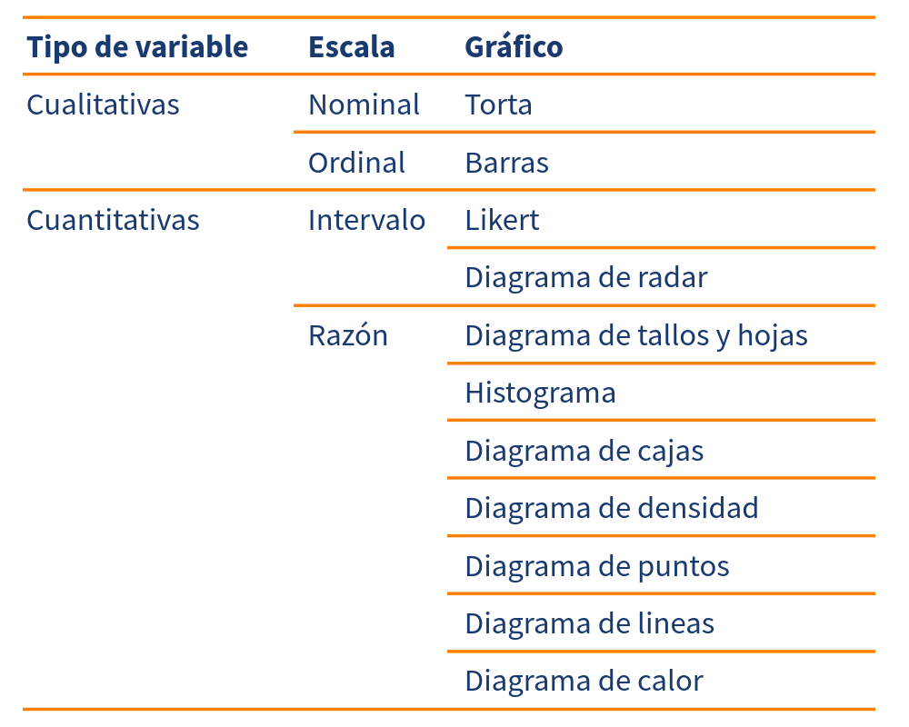
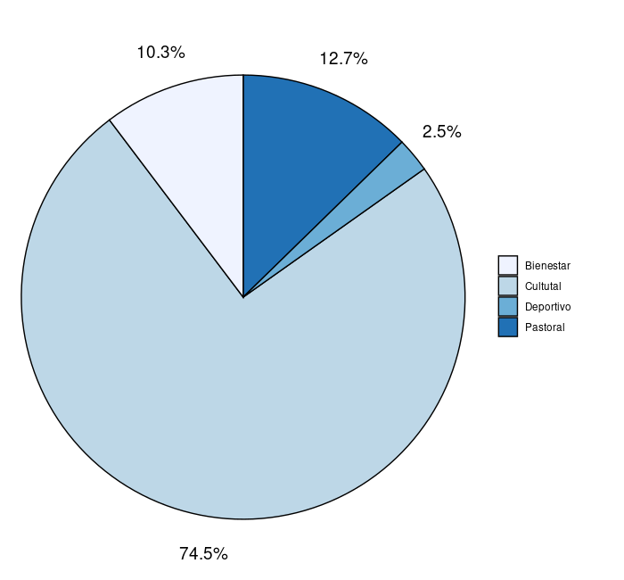
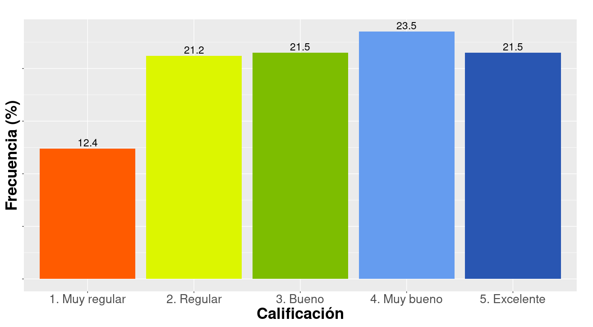
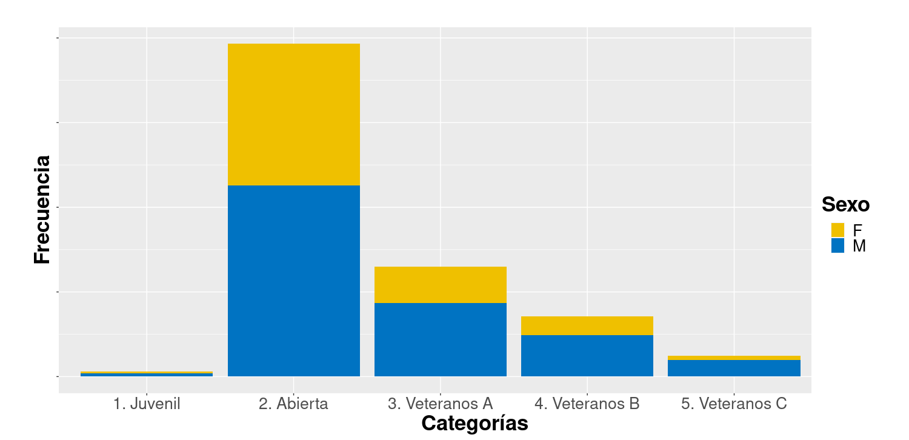
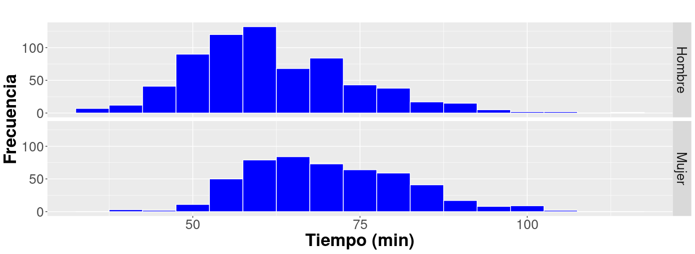
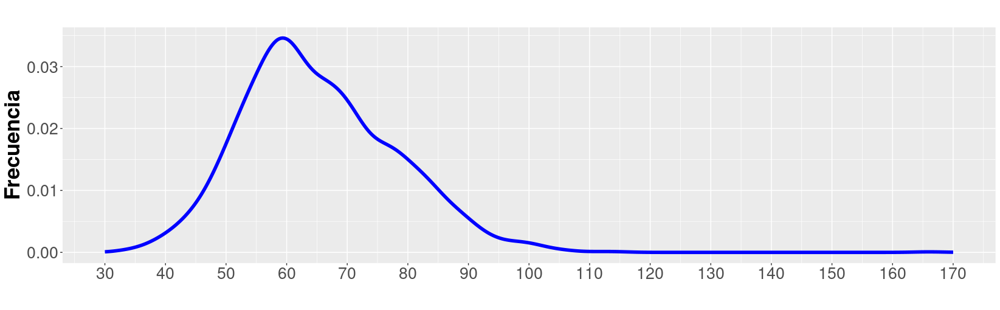
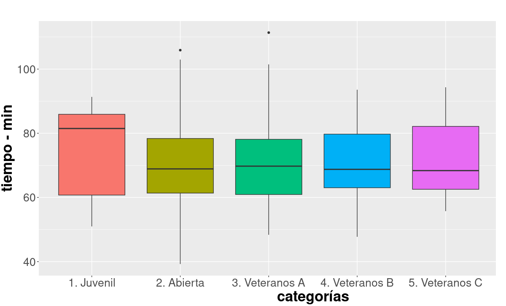
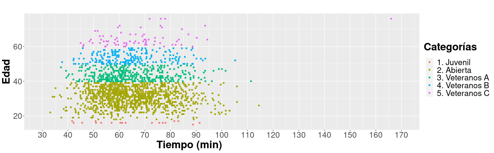
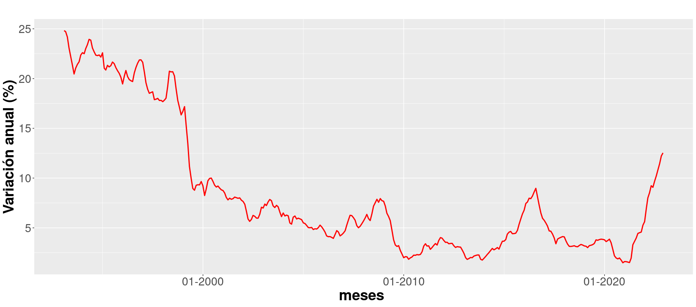

```{r setup, include=FALSE}
knitr::opts_chunk$set(echo = TRUE, message = FALSE, warning = FALSE, comment = NA)

# install.packages('gtools')
# install.packages("TeachingSampling")

#load library
library(gtools)
library(TeachingSampling)
library(readr)
library(paqueteMET)

c1="#FF7F00"
c2="#034A94"
c3="#0EB0C6"
c4="#686868"


```

</br></br>

<!-- ======================================================================= -->

<div class="content-box-gray">

> "Se denomina gráfico a una representación visual de una serie de datos, representación que tiene como finalidad dar una rápida noción acerca de volúmenes, cantidades y porcentajes, estableciendo comparaciones". 
>
> enciclopedia.net

</div>

<br/><br/>

Elegir el gráfico adecuado es muy importante, pues existen diferentes alternativas  y se debe escoger el apropiado para representar los datos. El tipo de dato determina el tipo de gráfico así:


Tabla  1 : Gráficas por tipo de variable
```{r, echo=FALSE, out.width="70%", fig.align = "center"}

```
<center>
<sub>
Fuente: construcción propia
</sub>
</center>
<br/><br/>

# <span style="color:#034a94">**Variables cualitativas**</span>

<br/>

## <span style="color:#034a94">**Diagráma circular (Tortas)**</span>

Este tipo de gráficos se utiliza para variables cualitativas medidas en escala nominal.

Gráfica  1 : Distribución demanda actividades del Medio Universitario 
```{r, echo=FALSE, out.width="70%", fig.align = "center"}

```
<center>Fuente : Unicifras Pontificia Universidad Javeriana Cali</center>

El gráfico permite resaltar la gran participación de los estudiantes en el sector Cultural con un 74.5%

<br/><br/>

## <span style="color:#034a94">**Diagrama de barras**</span>

El diagrama de barras se utiliza para representar variables cualitativas en escala ordinal.  Es necesario que los valores representados sigan el orden de la escala.


Gráfica  2 : Evaluación pasajeros areopuerto 
```{r, echo=FALSE, out.width="100%", fig.align = "center"}

```
<center>
<sub>
Fuente: kaggle - Satisfacion_Airline
</sub>
</center>

<br/><br/>

## <span style="color:#034a94">**Barras con dos variables**</span>

Este diagrama se emplea para representar dos variables cualitativas que pueden ser de escala nominal u ordinal.


Gráfica  3 : Distribución de la categoría por sexo carrera La Luz 2022 
```{r, echo=FALSE, out.width="100%", fig.align = "center"}

```

<center>
<sub>
Fuente :[juanchocorrelon](https://www.athlinks.com/event/212331/results/Event/1031677/Results)
</sub>
</center>

<br/><br/><br/>


# <span style="color:#034a94">**Variables cualitativas**</span>

<br/>

## <span style="color:#034a94">**Diagrama de árbol**</span>

Gráfica  4 : Diagrama de tallos y hojas tiempos mujeres categoría Veteranas A 

<pre>
The decimal point is 1 digit(s) to the right of the |

4 | 89
5 | 02234
5 | 555566666788899
6 | 00000011111122222333344444
6 | 5555666677888899
7 | 0000011122233333333344
7 | 555666678888999
8 | 011123334
8 | 5556778899
9 | 02334
9 | 67
10 | 1
10 | 
11 | 1
</pre>

<center>
<sub>
Fuente:[juanchocorrelon](https://www.athlinks.com/event/212331/results/Event/1031677/Results)
</sub>
</center>

Este diagrama ordena los datos de manera que se puede determinar tanto el mínimo (48 min) como el máximo (111 min) , además de visualizar donde están la mayor concentración de ellos. 

El diagrama divide los datos en dos partes : 

* tallo : dígitos delanteros 
* hoja  : últimos dígitos 

4 | 89   : representa 48 minutos que corresponde al mínimo seguido de 49
5 | 0    : 50 minutos 


<br/><br/>

## <span style="color:#034a94">**Histograma**</span>

El histograma es uno de los gráficos más utilizados para representar variables cuantitativas y permite resumir por rangos los diferentes datos. Es una buena forma de visualizar la distribución de los datos y su forma.

Cada barra representa la cantidad de observaciones que se encuentra en cada uno de los intervalos establecidos, permitiendo visualizar el intervalo con mayor concentración de datos, además de la forma que tiene su distribución. 


Gráfica  5 : Distribución del tiempo por sexo categoría abierta carrera La Luz 2022 
```{r, echo=FALSE, out.width="100%", fig.align = "center"}

```
<center>
<sub>
Fuente :[juanchocorrelon](https://www.athlinks.com/event/212331/results/Event/1031677/Results)
</sub>
</center>

<br/><br/>

## <span style="color:#034a94">**De densidad**</sub>

Este diagrama corresponde a un contorno suavizado del histograma que permite visualizar claramente la forma de los datos. 

Gráfica  6 : Distribución del tiempo carrer La Luz 2022 
```{r, echo=FALSE, out.width="100%", fig.align = "center"}

```

<center>
<sub>
Fuente :[juanchocorrelon](https://www.athlinks.com/event/212331/results/Event/1031677/Results)
</sub>
</center>

<br/><br/>

## <span style="color:#034a94">**De cajas**</span>

Es uno de las representaciones gráficas más utilizadas, pues además de los elementos y características que permite visualizar de las variables, permite comparar los resultados de dos o más grupos.


Gráfica  7 : Comparación distribuciones del tiempo hombres carrera La Luz 2022 
```{r, echo=FALSE, out.width="100%", fig.align = "center"}

```

<center>
<sub>
Fuente :[juanchocorrelon](https://www.athlinks.com/event/212331/results/Event/1031677/Results)
</sub>
</center>

<br/><br/>

## <span style="color:#034a94">**De dispersión**</span>

Este diagrma de puntos permite visualizar la relación lineal que puede existir entre dos variables cualitativas.


Gráfica  8 : Distribución de los tiempos por categoría carrera La Luz 2022 
```{r, echo=FALSE, out.width="100%", fig.align = "center"}

```

<center>
<sub>
Fuente :[juanchocorrelon](https://www.athlinks.com/event/212331/results/Event/1031677/Results)
</sub>
</center>

La gráfica permite visualizar que no existe relación líneal entre las variables tiempo de carrera y edad, es decir que en todas las categorías se presentaron corredores con tiempos bajos y tiempos altos.  También permite detectar que un corredor de la categoría Abierta fue el primero en cruzar la meta (33.13 min) y uno de la categoría Veteranos C el último (166.03 min). 

<br/><br/>

## <span style="color:#034a94">**De líneas**</span>

Este tipo de gráficas se utiliza principalmente para representar series de tiempo y poder de esta manera observar si presentan tendencias o comportamientos estacionales


Gráfica  9 : Inflación Colombia 1993-01 a 2022-11 
```{r, echo=FALSE, out.width="100%", fig.align = "center"}

```
<center>
<sub>
Fuente : Banco de la República
</sub>
</center>

En la gráfica se puede observar una tendencia creciente durante los últimos meses


<br/><br/>
