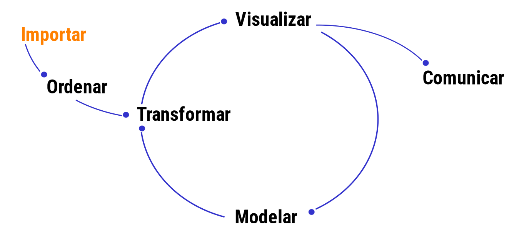
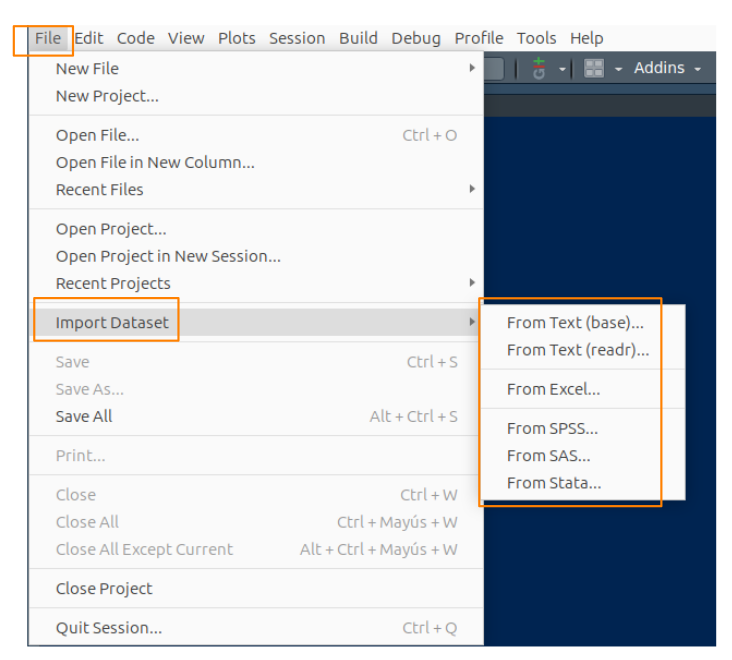

```{r setup, include=FALSE}
knitr::opts_chunk$set(echo = TRUE, message = FALSE, warning = FALSE, comment = NA)

# install.packages('gtools')
# install.packages("TeachingSampling")
# devtools::install_git("dgonxalex80/paqueteMETODOS")hub
#load library
library(gtools)
library(TeachingSampling)
library(readr)
library(paqueteMETODOS)

c1="#FF7F00"
c2="#034A94"
c3="#0EB0C6"
c4="#686868"

data(rotacionNA)

```


</br></br>

La importación de los datos es una de las etapas importantes del proceso para el análisis de datos, que depende del formato y las fuentes generadoras los datos. Esta etapa forma parte del ciclo los de datos.

<!-- ======================================================================= -->


```{r, echo=FALSE, out.width="60%", fig.align = "center"}

```


<center>
**Figura : 1.5 ** Ciclo de datos  <br/>
<sub> Tomado de [Ciencia de Datos y Políticas Públicas](https://datosgcba.github.io/ciencia-de-datos-politicas-publicas/docs/) </sub>
</center>

</br></br>

En **R** se puede importar los datos de diferentes formas: 

</br>

### <span style="color:#034a94">**1. Utilizando el menú RStudio**</span> 


```{r, echo=FALSE, out.width="70%", fig.align = "center"}

```

<br/>

|
|:------------------------|:--------------------------------------------|:------------------------------------|
|   **formato .txt**      | *File/Import Dataset/From Text (base)*      | formato texto separado por espacios |
|   **formato .csv**      | *File/Import Dataset/From text (base)*      | formato csv separado por ;  o por ,  |
|   **formato .xlsx**     | *File/Import Dataset/ From Excel*           | formato excel                       |
|   **formato .dat**      | *File/Import Dataset/ From SPSS*            | formato SPSS - programa estadístico |
|   **formato .sas7bdat** | *File/Import Dataset/ From SAS*             | formato SAS - programa estadístico  | 
|   **formato .dta**      | *File/Import Dataset/ From Stata*           | formato STATA - programa estadístico|
|                         |                                             |
</br></br>


<div class="content-box-gray">
### <span style="color:#686868">**Nota**</span> 

Los anteriores caso implican que tengamos la base de datos descargada en una carpeta de nuestro PC
</div>

</br></br>

### <span style="color:#034a94">**2. Utilizando API y token desde un repositorio externo**</span>

Podemos importar la base de datos de un repositorio que maneje API a través de un token. En este caso debemos solicitar el token e instalar el paquete `RSocrata`

</br></br>

### <span style="color:#FF7F00">**Ejemplo**</span>

El siguiente código importa la base de datos de la Secretaria de Salud correspondiente a las personas reportadas con Covid-19 para el territorio Colombiano.  Para ello se debe solicitar en la plataforma de Datos Abiertos Colombia un token y realizar la siguiente solicitud  


```{r, eval=FALSE }
# install.packages("RSocrata", dependencies = TRUE)   # instalación de paquete RSocrata, solo una vez
library(RSocrata)    # llamado de libreria
token <- "zxMsD6eXc0zlEMryRGW87Hwrz"  # token
Colombia <- read.socrata("https://www.datos.gov.co/resource/gt2j-8ykr.json", app_token = token) # lectura 
```

</br>

<pre>
install.packages("RSocrata", dependencies = TRUE)   
library(RSocrata)    # llamado de libreria
token <- "zxMsD6eXc0zlEMryRGW87Hwrz"  # token
Colombia <- read.socrata("https://www.datos.gov.co/resource/gt2j-8ykr.json", app_token = token) # lectura 
</pre>

</br>

Este proceso tarde unos minutos pues  la base es grande

Para guardar el archivo en una carpeta `data`, se recomienda el formato `RDS` por ocupar menos espacio.  En este caso se guarda el archivo descargado con el nombre de *Colombia.RDS* en la carpeta *data/*

</br>

```{r, eval=FALSE}
saveRDS(Colombia, file = "data/Colombia.RDS") 
```

</br>

<pre>
saveRDS(Colombia, file = "data/Colombia.RDS") 
</pre>

</br></br>

### <span style="color:#034a94">**4. Desde un paquete de R instalado**</span> 

Es psosible trabajar con una `dataset` disponible en los paquetes de R. Para ello solo utilizamos la función `data()`

</br></br>

### <span style="color:#FF7F00">**Ejemplo**</span>

```{r, eval=FALSE}
data(iris)  # data set iris
data(cars)  # data set cars
data(vivienda_faltantes) # data contenida en paqueteMETODOS
```


<pre>
data(iris)  
data(cars) 
data(vivienda_faltantes)  
</pre>


</br></br>

<div class="content-box-gray">
### <span style="color:#686868">**Nota**</span> 
se tiene tengo un archivo en un equipo, puede utiliza la función: `file.choose()` , para conocer la ruta donde esta  el archivo  y luego se copia la ruta obtenida con Ctrl+C, 

```{r, eval=FALSE, warning=FALSE, message=FALSE}
file.choose()
```


En este caso se genera la ruta "data/Colombia.RDS", como resultado de ejecutar la función anterior y ubicar el archivo a importar. (`Colombia<- readRDS("data/Colombia23.RDS")`)


```{r, eval=FALSE}
Colombia<- readRDS("data/Colombia23.RDS")
```

</div>

</br></br>

R permite importar datos en diferentes formatos :

**Tabla 1.1** : formatos de datos importados en R  

| Formato    | libreria R        | código                                                           |
|:-----------|:------------------|:------------------------------------------------------------------|
| .texto     | `library(readr)`   | `datos <- read_delim("ruta_del_archivo/datos.txt", delim = ",")` |
| .csv       | `library(readr)`   | `datos <- read.csv("datos.csv")`                                 |
| .xlsx      | `library(readxl)`  | `datos <- read_excel("datos.xlsx", sheet = "hoja1")`             |
| .json      | `library(jsonlite)`| `datos <- fromJSON("datos.json")`                                |
| .stata     | `library(haven)`   | `datos_stata <- read_dta("datos_stata.dta")`                     |
| .spss      | `library(haven)`   | `datos_spss <- read_sav("datos_spss.sav")`                       |
| .sas       | `library(haven)`   | `datos_sas <- read_sas("datos_sas.sas7bdat")`                    |
|            |                    |                                                                  |


</br></br> 

<div class="content-box-yellow">
### <span style="color:#034A94">**Retos**</span> 
* Importa la base de datos a  la fecha de Covid-19

```{r, eval=FALSE }
install.packages("RSocrata", dependencies = TRUE)   # instalación de paquete RSocrata
library(RSocrata)    # llamado de libreria
token <- "zxMsD6eXc0zlEMryRGW87Hwrz"  # token - cada uno puede obtener su token en la pagina de Datos Abiertos Colombia
Colombia <- read.socrata("https://www.datos.gov.co/resource/gt2j-8ykr.json", app_token = token) # lectura 
```

* Importa la base de datos del `dataset` :  `flights` del paquete `nycflights13` y explore sus principales características

</div>


