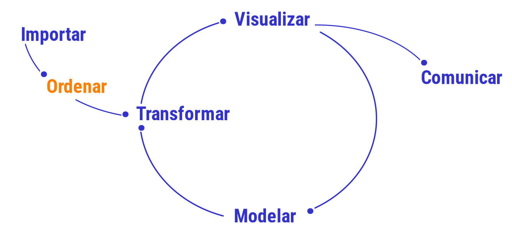

```{r setup, include=FALSE}
knitr::opts_chunk$set(echo = TRUE, message = FALSE, warning = FALSE, comment = NA)

# install.packages('gtools')
# install.packages("TeachingSampling")

#load library
library(gtools)
library(TeachingSampling)
library(readr)
library(paqueteMETODOS)
library(tidyverse)

c1="#FF7F00"
c2="#034A94"
c3="#0EB0C6"
c4="#686868"

library(paqueteMETODOS)
data("vivienda_faltantes")

data("rotacionNA")      # carga data set rotacionNA del paqueteMETODOS
set.seed(123)           # fija semilla para numeros aleatorios
rotacionNA<-sample_n(rotacionNA, 1000) # toma una muestra de tamaño 1000 de la data
datosNA <- rotacionNA  # copia el contenido a datosNA


```

</br></br>

<!-- ======================================================================= -->

Una de las tareas más importante al realizar un proyecto de Ciencia de Datos corresponde a la preparación de los datos (Limpieza de datos o data cleaning) que posteriormente va a permitir el modelamiento adecuado de los datos. 


```{r, echo=FALSE, out.width="60%", fig.align = "center"}

```

Este ciclo comprende :

* Importación de los datos - ya tratado -
* Fusión de datos
* Datos faltantes
* Estandarización
* Normalización
* Elinación de registros duplicados
* Verificación y enrequecimiento
* Exportación de los datos

</br></br>

Al importar una base de datos que está conformada por una matriz con $n$ filas o registros  y $m$ columnas o variables se presentan problemas relacionados con:

* Datos faltantes (NA)
* Reemplazar los datos faltantes - imputación
* Datos extraños o  atípicos
* Necesidad de estandarizar los valores con el fin varias variables sean comparables (una misma escala)
* Construir nuevas variables a partir de las contenidas en la base
* Cambiar el formato de una variable - formato corto y formato largo -
* Aumentar los registros contenidos en dos bases - adicionar registros -
* Agregar variables contenidas en dos bases

</br></br>

A contunuación se presentan algunos de estos temas que permiten tratar y dejar lista la base de datos de interes para iniciar el análisis de datos

</br></br>

# <span style="color:#034a94">**Tratamiento de datos faltantes**


El tratamiento de datos faltantes es un aspecto crítico en Ciencia de Datos, ya que ellos pueden afectar de manera significativa la calidad y validez de los análisis y modelos que realicemos. Acontinuación se presentan algunas estrategias comunes para manejar los datos faltantes:

</br>

### <span style="color:#034a94">**1. Eliminacion de los registros  o filas**</span>

Si los **datos faltantes** son pocos en comparación con el tamaño total del conjunto de datos, una estrategia es eliminar los registros o filas que contienen datos faltantes. Sin embargo, esta estrategia puede llevar a una pérdida de información si los datos faltantes son sistemáticos o si se eliminan muchas observaciones en comparación con el tamaño de la base de datos.

</br>


### <span style="color:#FF7F00">**Ejemplo**

A partir de la base de datos `rotacionNA` contenida en `paqueteMETODOS`, se plantera examinar una muestra de ella de tamaño `1000 x 25` que se puede obtener con el siguiente código :


```{r, eval=FALSE}
library(paqueteMETODOS) # carga paqueteMETODOS
library(dplyr)          # carga paqiete dplyr 
data("rotacionNA")      # carga data set rotacionNA del paqueteMETODOS
set.seed(123)           # fija semilla para numeros aleatorios
rotacionNA<-sample_n(rotacionNA, 1000) # toma una muestra de tamaño 1000 de la data
datosNA <- rotacionNA  # copia el contenido a datosNA
str(datosNA)  # explora contenido de datosNA
```

<pre>
spc_tbl_ [1,000 × 25] (S3: spec_tbl_df/tbl_df/tbl/data.frame)
 $ id                         : num [1:1000] 415 463 179 526 195 ...
 $ Rotación                   : chr [1:1000] "Si" "No" "No" "Si" ...
 $ Edad                       : num [1:1000] 24 34 46 24 45 39 30 46 34 34 ...
 $ Viaje de Negocios          : chr [1:1000] "Raramente" "Raramente" "Raramente" "Raramente" ...
 $ Departamento               : chr [1:1000] "Ventas" "Ventas" "Ventas" "Ventas" ...
 $ Distancia_Casa             : num [1:1000] 1 21 1 3 2 13 7 2 2 10 ...
 $ Educación                  : num [1:1000] 1 4 2 2 2 4 3 2 4 3 ...
 $ Campo_Educación            : chr [1:1000] "Tecnicos" "Ciencias" "Mercadeo" "Ciencias" ...
 $ Satisfacción_Ambiental     : num [1:1000] 1 4 2 1 1 3 2 4 4 4 ...
 $ Genero                     : chr [1:1000] "F" "M" "F" "F" ...
 $ Cargo                      : chr [1:1000] "Representante_Ventas" "Ejecutivo_Ventas" "Ejecutivo_Ventas" "Ejecutivo_Ventas" ...
 $ Satisfación_Laboral        : num [1:1000] 2 4 1 3 4 2 2 4 4 3 ...
 $ Estado_Civil               : chr [1:1000] "Soltero" "Soltero" "Divorciado" "Soltero" ...
 $ Ingreso_Mensual            : num [1:1000] 3202 5337 10453 4577 16792 ...
 $ Trabajos_Anteriores        : num [1:1000] 1 1 1 9 9 6 1 3 0 1 ...
 $ Horas_Extra                : chr [1:1000] "Si" "No" "No" "No" ...
 $ Porcentaje_aumento_salarial: num [1:1000] 16 12 25 14 23 13 12 14 14 14 ...
 $ Rendimiento_Laboral        : num [1:1000] 3 3 4 3 4 3 3 3 3 3 ...
 $ Años_Experiencia           : num [1:1000] 6 10 24 4 22 21 6 12 6 15 ...
 $ Capacitaciones             : num [1:1000] 4 3 2 3 1 4 3 4 3 3 ...
 $ Equilibrio_Trabajo_Vida    : num [1:1000] 3 3 3 3 3 3 2 2 3 3 ...
 $ Antigüedad                 : num [1:1000] 5 10 24 2 20 19 6 9 5 15 ...
 $ Antigüedad_Cargo           : num [1:1000] 3 7 13 2 8 9 4 8 0 14 ...
 $ Años_ultima_promoción      : num [1:1000] 1 5 15 2 11 15 1 4 1 0 ...
 $ Años_acargo_con_mismo_jefe : num [1:1000] 4 7 7 0 8 2 1 7 2 7 ...
</pre>

<br/>

Con la función  `str()`  se obtiene una visualización del tamaño de la base de datos, las variables que la conforman y el tipo de variables y una muesrta de los primeros valores.

Ahora para visualizar que variables y con que frecuencia se presentan los datos faltantes o `NA` utilizamos el siguiente código

<br/>

```{r}
library(dplyr)
faltantes <- colSums(is.na(datosNA)) %>%
                 as.data.frame() 

faltantes

```

<br/><br/>


La función   `colSums(is.na(datosNA))`  totaliza  el número total de datos faltantes por variable para la data `datosNA`


<br/>


```{r, message=FALSE, warning=FALSE}
# install.packages("naniar")
library(naniar)
gg_miss_var(datosNA) # grafico de datos faltantes
```


En esta gráfica podemos visualizar que las viables : Viaje de Negocio, Estado Civil, Rotacion, Genero, Departamento y Horas Extras presentan datos faltantes. Para ello se utiliza la función  `gg_miss_var(datosNA)`

</br></br>

Otra forma de detectar y representar gráficamente los datos faltantes es utilizando la función `md.pattern(datosNA, rotate.names = TRUE)`  del paquete `mice`


```{r}
# install.packages("VIM")
VIM::aggr(datosNA, cex.axis = 0.5, cex.lab= 0.8)  # graficos de datos faltantes
```


En este caso se observa una primera fila que represnta los registros tienen informaciçon completa (sin datos faltantes). Las filas restantes donde aparecen cuadrados en rojo, representan los datos faltantes para las variables Viaje de Negocio, Estado Civil, Rotacion, Genero, Departamento y Horas Extras .

Detectados la proporción de datos faltantes procederemos como una primera estrategia a eliminarlos por completo


</br></br>

#### <span style="color:#686868">**Eliminación de datos faltantes**</span>


La función : `na.omit()`  , permite elimitar todos los registros contenidos en la base de datos que contenga datos faltantes (NA) 


* **Verifique que se han eliminado los datos faltantes**


```{r, eval=FALSE}
# install.packages("VIM")
datosSINA <- na.omit(datosNA)  # elimina todos los valores con  NA
VIM::aggr(datosSINA, cex.axis = 0.4, cex.lab= 0.8)
cat("dimensión dataSINA : ", dim(datosSINA))
```

Este proceso elimina 100 de los registros, dejando una data de `900 x 25` .

</br></br>

### <span style="color:#034a94">**2. Tratamiento de datos faltantes como una categoría** 

En el caso de variables categóricas o cualitativas sus valores faltantes se pueden encontrar a partir del modelamiento la sub-base con registros completos 

los datos faltantes pueden tener un significado propio y no deben ser imputados ni eliminados. En lugar de eso, puedes considerar tratar los datos faltantes como una categoría adicional en el análisis o modelo (faltante) .


</br>


```{r}
datosNA <- rotacionNA
datosNA$Otro_motivo <- 0
datosNA$faltante[is.na(datosNA$`Viaje de Negocios`)] <- 1 
VIM::aggr(datosNA, cex.axis = 0.4, cex.lab= 0.8)
```

</br></br>

## <span style="color:#034a94">**2. Imputación de valores**</span> 


Si no se desea eliminar los registros que contiene datos faltantes,  dado que se puede perder un gran porcentaje de la información, entoces se recurre a reemplazar estos valores, primero calculado el valor por el cual se debe reemplazar (**imputación de datos**). 

Para realizar este procedimiento se tienen varias alternativas, cambiando los datos faltantes por :

* cero
* la media
* mediana
* por el valor de un registro completo semejante al del dato faltante - tecnicas avanzadas de imputación -
 
</br></br>

### <span style="color:#FF7F00">**Ejemplo**</span>

###  <span style="color:#686868">**Caso imputación por cero**</span>

En el caso de la data `rotacionNA`, es posible que los  empleados  al ser interrogados, entendieron que no debian responder la pregunta: **Horas Extras**, cuando no trabajan horas por fuera de su jornada laboral. 

En otros casos es posible que se trate de un dato faltante real -no respuesta - y se deba reeplazar por un valor que lo represente. 

El caso de reemplazar los  `NA` por **cero** en la variable `Horas_Extra`,  se procede la siguiente forma:

<pre>
datosNA$Años_Experiencia[is.na(datosNA$Años_Experiencia)] <- 0
</pre>

```{r}
datosNA <- rotacionNA
datosNA$Años_Experiencia[is.na(datosNA$Años_Experiencia)] <- 0
VIM::aggr(datosNA, cex.axis = 0.5, cex.lab= 0.8)
```

</br></br>

### <span style="color:#686868">**Caso reemplazo por la media**</span> 

En el caso de reemplazar el `NA` por el valor correspondiente a la media se asigna este valor de la siguiente manera:

<pre>
# Calcula la media de la variable "Años_Experiencia"
media_Años_Experiencia <- mean(datosNA$Años_Experiencia, na.rm = TRUE) %>%
                    round(,0)
# se asigna el valor medio en los registro con datos faltantes
datosNA$Años_Experiencia[is.na(datosNA$Años_Experiencia)] <- media_Años_Experiencia

media Años_Experiencia :  12
</pre>

```{r, message=FALSE, warning=FALSE}
datosNA <- rotacionNA

# Calcula la media de la variable "Años_Experiencia"
media_Años_Experiencia <- mean(datosNA$Años_Experiencia, na.rm = TRUE) %>%
                    round(,0)

datosNA$Años_Experiencia[is.na(datosNA$Años_Experiencia)] <- media_Años_Experiencia
VIM::aggr(datosNA, cex.axis = 0.4, cex.lab= 0.8)
cat("media Años_Experiencia : ", media_Años_Experiencia)

```


<div class="content-box-gray">
### <span style="color:#686868">**Nota**</span>

Dado que la variable número de parqueaderos es un valor entero, se aproxima al entero más cercano con la función `round()`

<</div>


</br></br>

#### <span style="color:#686868">**Caso reemplazo por la mediana**</span> 

En el caso de reemplazar el NA por el valor correspondiente a la mediana se asigna este valor de la siguiente manera:


```{r, message=FALSE, warning=FALSE}
datosNA <- rotacionNA
# Calcula la mediana de la variable "Años_Experiencia"
mediana_Años_Experiencia <- median(datosNA$Años_Experiencia, na.rm = TRUE) %>%
                    round(,0)

datosNA$Años_Experiencia[is.na(datosNA$Años_Experiencia)] <- mediana_Años_Experiencia
VIM::aggr(datosNA, cex.axis = 0.4, cex.lab= 0.8)
cat("mediana Años_Experiencia : ", mediana_Años_Experiencia)
```


</br></br>

### <span style="color:#686868">**Caso reemplazo por la moda**</span> 

En el caso de la variable piso, que corresponde cualitativa de escala ordinal, si se desea reemplazar por la moda a los datos faltantes procedemos de la siguiente forma:


```{r, message=FALSE, warning=FALSE}

# install.packages("DescTools")
library(DescTools)
moda_Estado_Civil <- Mode(datosNA$Estado_Civil, na.rm = TRUE)
datosNA$Estado_Civil[is.na(datosNA$Estado_Civil)] <- moda_Estado_Civil
VIM::aggr(datosNA, cex.axis = 0.5, cex.lab= 0.8)
cat("moda Estado_Civil : ", moda_Estado_Civil)

```

</br></br>

### <span style="color:#034a94">**3. Técnicas más avanzadas**</span>

Los valores faltantes pueden ser reemplazados por valores obtenidos a a partir modelos, donde se construyen para estimar los valores faltantes de manera predictiva.

Existen métodos Aavanzados para imputar datos faltantes, como la imputación múltiple (multiple imputation) y la imputación basada en modelos de aprendizaje automático. Estos enfoques generan múltiples conjuntos de datos imputados y tienen en cuenta la incertidumbre asociada con la imputación. Los cuales serán tratado mas adelante.

</br>

Es importante evaluar cuidadosamente el patrón y la naturaleza de los datos faltantes antes de decidir qué estrategia utilizar. Además, es fundamental tener en cuenta que los método de imputación introduce incertidumbre y puede afectar los resultados de los análisis o modelos. Por lo tanto, es recomendable documentar y tener en cuenta el proceso de imputación en el análisis y la interpretación de los resultados.


