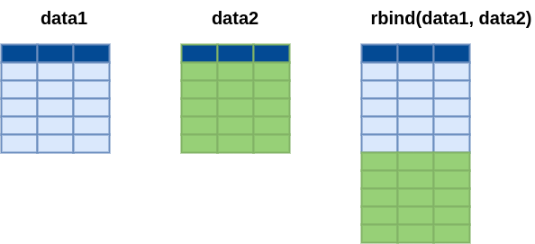
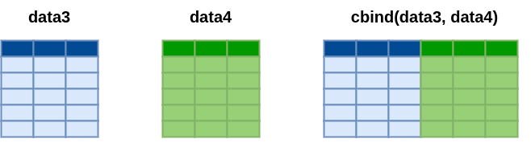
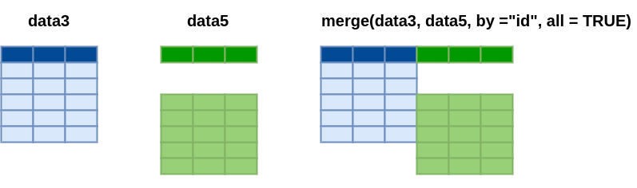

```{r setup, include=FALSE}
knitr::opts_chunk$set(echo = TRUE, message = FALSE, warning = FALSE, comment = NA)

library(paqueteMETODOS)
data("rotacion")
id = 1:1470
data= data.frame(id, rotacion)

data1 = data[1:6,c(2,3,4,5)]
data2 = data[7:12,c(2,3,4,5)]
data3 = data[1:12,c(2,3)]
data4 = data[1:12,c(4,5)] 
```

<br/><br/>

Una de las necesidades impotante en el manejo de bases de datos la conforma el agregar mas registros o filas a una base de datos o de agregar nuevas variables.

<br/>

Esta etapa implica combinar datos provenientes de múltiples fuentes en una única estructura de datos, permitiendo un análisis más completo y holístico. La fusión de datos se utiliza comúnmente cuando se trabaja con conjuntos de datos que comparten una o más variables en común, como identificadores únicos, fechas o categorías.


En **R**, uno de los paquetes más utilizados para realizar la fusión de datos es el paquete `dplyr`, que forma parte del grupo de paquetes agrupados en `tidyverse`


En este caso se presentan dos casos :

* Adicionar registros a una base de datos 
* Adicionar variables a una base de datos

<br/><br/>

## <span style="color:#034a94"> **Adicionar registros**</span>


```{r, echo=FALSE, out.width="70%", fig.align = "center"}

```


<br/>

### <span style="color:#FF7F00"> **Ejemplo**</span>

Para ilustrar el primer caso tomaremos una muestras pequeñas de la base rotacion contenida en paqueteMETODOS

<br/>

### <span style="color:#034a94"> **data1**</span>

Esta base contiene información de tres variables, correspondientes a 6 personas


```{r}

library(paqueteMETODOS)
data("rotacion")
id = 1:1470
data= data.frame(id, rotacion)

data1 = data[1:6,c(2,3,4,5)]
data1
```

<br/><br/>

### <span style="color:#034a94"> **data2**</span>

Esta segunda base contiene las mismas tres variables pero que corresponden a otras 6 personas y deseamos juntar todos los registros ( en total 12) en una sola base de datos

```{r}

library(paqueteMETODOS)
data("rotacion")
id = 1:1470
data= data.frame(id, rotacion)

data2 = data[7:12,c(2,3,4,5)]
data2
```

<br/>

Para unir estas dos base utilizamos la función `rbind()` del paquete `dplyr`.


```{r}
library(dplyr)
data20 = rbind(data1,data2)
data20
```


<br/><br/>

### <span style="color:#034a94"> **Adicionar variables**</span>

En la adición de variables se presentan dos casos El primero corresponde a la unión de dos o más columas contenidas en bases diferentes pero que deben estar ordenadas en la misma foma para que coincidan los registros.

En el segundo caso las bases de datos deben contener una llave que permita indexar sus registros.


<br/>

### **Caso 1**


```{r, echo=FALSE, out.width="70%", fig.align = "center"}

```

<br/>

### <span style="color:#FF7F00"> **Ejemplo**</span>

<br/>

Para ilustrar este caso tomaremos una muestra de la data `rotacion` contenida en `paqueteMET` para conformar las bases `data3`, `data4` y `data5`: 


<br/>

```{r}
library(paqueteMETODOS)
data("rotacion")
id = 1:1470
data= data.frame(id, rotacion)
data3 = data[1:10,c(1,2,3)]
data4 = data[1:10,c(1,4,5)]
data5 = data[3:12,c(1,4,5)]
```

<br/><br/>

### <span style="color:#034a94"> **data3**</span>

Conformada por 10 registros y tres variables dentro de las cuales esta id que sirve en este caso para verificar que los registros estan en un mismo orden.


```{r}
data3
```


<br/><br/>


### <span style="color:#034a94"> **data4**</span>

data4 contiene además del identificador otras dos variables

```{r}
data4
```


<br/>

En este caso se tienen las funciones :

* `cbind()` Utilizada para combinar dos o mas conjuntos por columnas, agregando un conjunto de columnas. Es decir pegar dos datas que presentan el mismo orde de registros


<br/>

```{r}
cbind(data3, data4[,2:3])
```

<br/><br/>

### **Caso 2**

```{r, echo=FALSE, out.width="70%", fig.align = "center"}

```


* `merge()`. Se utiliza para combinar conjuntos de datos por columnas clave específicas, independientemente del número de filas. 


<br/><br/>

### <span style="color:#034a94"> **data5**</span>
```{r}
data5
```

<br/>

```{r}
merge(data3, data5, by = "id", all = TRUE)
```

<br/><br/>

<div class="content-box-gray">

### <span style="color:#686868"> **Nota**</span>

En el caso de unir columnas mediante la función `cbind()` , se combinan dos base de datos (`data3` y `data4`) de igual número de filas y que corresponde información que corresponde a las mismas personas. Para que no parezca la variable id repetida se quita de data4 dejando solo las columnas 2 a 3 - `data4[, 2:3]` - .

Para el caso de la función `merge()` , se requiere tener un indice que identifique cada regitro y por tanto no es necesario que los registros en las bases a unir se encuentren ordenadas. Para ello utilizamos las bases data3 y data5. En ellas se puede notar que la primera presenta los registros de las personas con id del 1 al 12, mientras que la data5 los registros correspondientes a las personas con id del 3 al 14. Es por esta razón que se toma como base la data3 y sobre ella se agregan los registros que coincidan al comparar su id con los de la `data5`. Quedanto vacios los resgistros de las personas con id 1 y 2.

</div>

<br/><br/>
`

