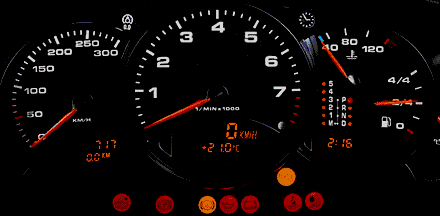
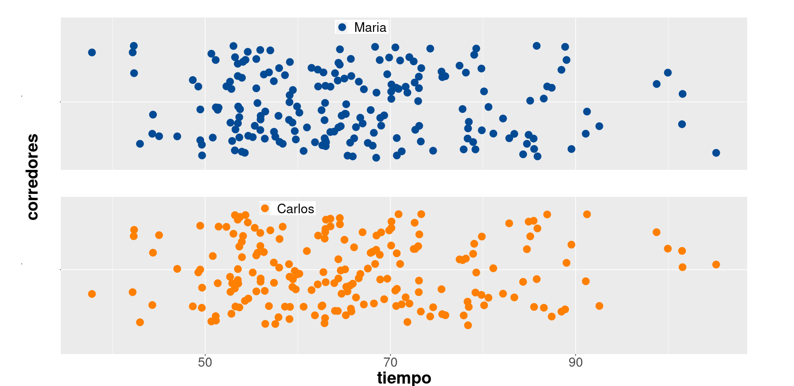
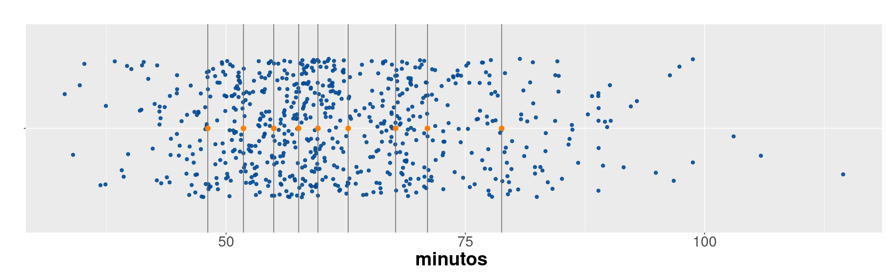
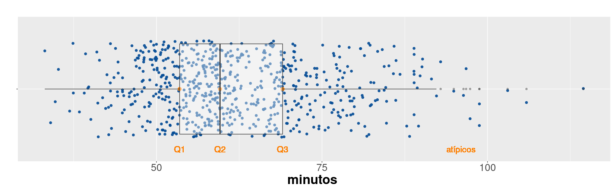

```{r setup, include=FALSE}
knitr::opts_chunk$set(echo = TRUE, comment = NA)

# install.packages('gtools')
# install.packages("TeachingSampling")
#devtools::install_github("dgonxalex80/paqueteMETODOS")

library(readr)
library(tidyverse)
library(DT)
library(paqueteMETODOS)
#-----------------------------------------------------
# Tamaños de letras gráficos con ggplot2
Theme1 = theme(
axis.title.x = element_text(size = 16),
axis.text.x = element_text(size = 12),
axis.title.y = element_text(size = 16),
axis.text.y = element_text(size = 12),
axis.text = element_text( size = 12),
legend.title = element_text(size = 12),
legend.text = element_text(size = 12),  
strip.text = element_text(size=12),
title =element_text(size=12, face='bold')
)# tamaño letra por grupos

Theme2 = theme(
axis.title.x = element_text(size = 26),
axis.text.x = element_text(size = 20),
axis.title.y = element_text(size = 26),
# axis.text.y = element_blank(),
axis.text = element_text( size = 20),
legend.title = element_text(size = 20),
legend.text = element_text(size = 20),  
strip.text = element_text(size=20),
title =element_text(size=20, face='bold')
)# tamaño letra por grupos
#-----------------------------------------------------
data("CarreraLuz22")
data("evaluacion")
data("inflacionov22")
load("~/Documentos/Javeriana/Ms Ciencia de Datos/repository/metodosySIM1/data/CarreraLu22F.rda")

```

</br>

# <span style="color:#034a94">**Indicadores estadísticos**</span> 

</br>

Cuando nos subimos a un auto observamos un tablero con muchos indicadores que permiten al conductor validar el estado del vehículo. El nivel de combustible, la temperatura, el estado de la batería, si alguna puerta esta abierta, la velocidad a la que se viaja, indicadores de las luces estacionarias, de giro, entre otros, permitiéndonos tomar decisiones en cada momento.  Todos estos indicadores son construidos con información que se sintetiza de diferentes maneras.


```{r, echo=FALSE, out.width="70%", fig.align = "center"}

```
</br>

Al igual que la situación anterior cuando nos enfrentamos a una análisis de datos, requerimos resumirlos en indicadores, tablas y gráficos que nos permitan un fácil análisis de ellos.

</br>

Por ejemplo para los datos cuantitativos se pueden utilizar tablas de frecuencia para identificando el valor con mayor frecuencia (más repetido), indicador que se denomina **MODA**.

</br>

Para las variable cuantitativas existen una serie de indicadores que caracterizan y facilitan su análisis como son :

* Indicadores de posición
* Indicadores de centro
* Indicadores de dispersión o variabilidad
* Indicadores de forma


</br></br>

<!-- ======================================================================= -->

Los **indicadores de posición** permiten identificar la posición relativa de un valor con respecto al grupo. Para entender el concepto se utiliza información correspondiente a una carrera de 10 kilómetros.


</br></br>

<center>
```{r, echo=FALSE, out.width="100%", fig.align = "center"}
knitr::include_graphics("img/carrera.jpg")
```

**Figura 1.5**  Indicadores de posición 
<br/>
<sub>
Tomada de : pixabay.com
</sub>
</center>

</br></br>

En octubre de 2022 se corrió la carrera de la Luz, contando con 1922 participantes en 10 categorías por edad y sexo. ( Juvenil, Abierta, Veteranos A, Veteranos B y Veteranos C para hombre y mujeres). 

<br/>

El siguiente gráfico de puntos representa los tiempos alcanzados por los participantes por categoría y sexo empleados para recorrer los 10 kilómetros de la competencia.

</br></br>


```{r, message=FALSE,warning=FALSE, fig.align='center', fig.height=5, fig.width=10 }
paleta6=c("#447270", "#6B9493", "#F6E271", "#F6B916", "#F69312", "#BC6C25")
p1=ggplot(CarreraLuz22F, aes(y=timerun/60, x=categoria))+
geom_jitter(color="#034A94", size=1, alpha=0.9) +
aes(color=paleta6)+
labs(title = "Mujeres",
y= "tiempo - min",
x= "categorías")+ 
#facet_wrap(~ sex)
#facet_grid(vars(sex), scale="free")+
ylim(0,170)+
Theme1

p1
```

```{r, message=FALSE,warning=FALSE, fig.align='center', fig.height=5, fig.width=10 }
library(paqueteMETODOS)
data("CarreraLu22M")
paleta6=c("#447270", "#6B9493", "#F6E271", "#F6B916", "#F69312", "#BC6C25")
p2=ggplot(CarreraLuz22M, aes(y=timerun/60, x=categoria))+
geom_jitter(color="#034A94", size=1, alpha=0.9) +
aes(color=paleta6)+
labs(title = "Hombres",
y= "tiempo - min",
x= "categorías")+ 
#facet_wrap(~ sex)
#facet_grid(vars(sex), scale="free")+
ylim(0,170)+
Theme1

p2
```

<center>
**Figura 1.6** Tiempos por categoría y sexo  - Carrera La Luz 2022
<br/>
<sub>
Fuente :[juanchocorrelon](https://www.athlinks.com/event/212331/results/Event/1031677/Results)
</sub>
</center>

</br></br>


Para un participante que llega a la meta es interesante poder comparar el resultado obtenido con respecto al grupo. La respuesta está en los indicadores de posición.

</br></br>

## <span style="color:#034a94">**Percentiles**</span>

Los **percentiles** corresponden a 99 valores que dividen los datos en cien partes de igual porcentaje ($P_1$, $P_2$, $P_3$, $P_4$, $\dots$, $P_{99}$),  cada una de las cuales contiene un 1% de los datos.

</br>

### <span style="color:#FF7F00">**Ejemplo**</span>

Para ilustrar el concepto, pensemos en que participamos de una carrera. El percentil dará cuenta de mi posición dentro del grupo. 

Ahora supongamos que dos corredores que se llamarán `María` y `Carlos` participaron en la carrera. `María` ocupó un lugar correspondiente al percentil 40 ($P_{40}$)  y `Carlos` ocupó el puesto que corresponde al percentil 30 ($P_{30}$). Podríamos afirmar que a Carlos obtuvo un mejor resultado que María ?. La respuesta es que se debe tener más información para poderlo afirmar.

El resultado depende del grupo en que participó cada uno de los corredores. Por ejemplo supongamos que :

`Carlos` tiene 55 años y pertenece por tanto a la categoría *Veteranos B* (corredores con edad entre los 50 y 60 años), mientras que `María` tiene 25 años y por tanto pertenece a la categoría *Abierta* (18 a 39 años).

Veamos en cada caso que tiempo marcaron los corredores con un punto en su respectivas categorías:

<center>
```{r, echo=FALSE, out.width="100%", fig.align = "center"}

```
**Figura 1.7**  Tiempos y posiciones de Carlos y María 
<br/>
<sub>
Fuente : [juanchocorrelon](https://www.athlinks.com/event/212331/results/Event/1031677/Results)
</sub>
</center>


</br></br>

## <span style="color:#034a94">**Deciles**</span>

Los **deciles** por su parte corresponden a 9 número que dividen la muestra en 10 partes, cada una con un 10% de la muestra ($D_{1}$, $D_{2}$, $D_{3}$, $D_{4}$, $\cdots$ , $D_{9}$).

</br>

### <span style="color:#FF7F00">**Ejemplo**</span>

Los deciles correspondientes a los tiempos registrados en la categoría Abierta para hombres se ilustran en la siguiente gráfica con los puntos naranjas. 

</br></br>

<center>
```{r, echo=FALSE, out.width="100%", fig.align = "center"}

```


**Figura 1.8** Deciles de los tiempos hombres categoría Abierta 
<br/>
<sub>
Fuente :[juanchocorrelon](https://www.athlinks.com/event/212331/results/Event/1031677/Results)
</sub>
</center>

</br></br>

<pre>
D1       D2       D3       D4       D5       D6       D7       D8       D9    
10%      20%      30%      40%      50%      60%      70%      80%      90% 
48.08    51.82    54.98    57.58    59.60    62.75    67.71    71.04    78.80 
</pre>

</br></br>

## <span style="color:#034a94">**Cuartiles**</span>

Los **cuartiles** son 3 números que dividen la muestra en cuatro partes, cada una con un 25% de los datos. Con estos indicadores se construye el diagrama de cajas que además de permitir comparar grupos, ayudan en la identificación de datos atípicos.

</br>

### <span style="color:#FF7F00">**Ejemplo**</span>

<center>
```{r, echo=FALSE, out.width="100%", fig.align = "center"}

```

**Figura 1.9** Tiempos hombres categoría Abierta 
<br/>
<sub>
Fuente :[juanchocorrelon](https://www.athlinks.com/event/212331/results/Event/1031677/Results)
</sub>
</center>

</br></br>

<pre>
Límite inferior        Q1          Q2           Q3           Límite superior
Q1 - 1.5(Q3-Q1)                                              Q3 + 1.5(Q3-Q1)
25%         50%          75%  
30.175                 53.50       59.60        69.05        92.375
</pre>

</br></br>

Los valores que queden por fuera de los límites inferior y superior, se consideran como datos atípicos, que son objeto de estudio por separado para averiguar sus causas. 


</br></br>

### <span style="color:#FF7F00">**Ejemplos**</span>

</br>

Los percentiles se utilizan en ciencia de datos para comprender la distribución de los datos, identificar valores atípicos, y realizar análisis comparativos. 

Como por ejemplo:

</br></br>

#### <span style="color:#034a94">**Identificación de valores atípicos**</sapn>

Los percentiles pueden ayudar a identificar valores extremos o atípicos en un conjunto de datos. `Q1 - 1.5(Q3-Q1)` y `Q3 + 1.5(Q3-Q1)`, representan dos límites a partir de los cuales se consideran datos atípicos. Este método fue planteado por John Tukey (1977).


</br>

#### <span style="color:#034a94">**Análisis de rendimiento en pruebas estandarizadas**</sapn>

En el sector de la educación, los percentiles se utilizan comúnmente para informar sobre el rendimiento de los estudiantes en pruebas estandarizadas. Un puntaje en el percentil 75, por ejemplo, indica que el estudiante superó al 75% de los participantes.

</br>

#### <span style="color:#034a94">**Evaluación de distribuciones de ingresos**</sapn>

En economía y sociología, los percentiles son útiles para entender la distribución de ingresos. Las curvas de distribución de la riqueza se basan en los quintiles, los cuales corresponden a los percentiles : P20, P40, P60, P80.

</br>

#### <span style="color:#034a94">**Segmentación de audiencia en marketing**</sapn>

En marketing, se pueden utilizar percentiles para segmentar audiencias según el comportamiento del cliente. r 

</br>

#### <span style="color:#034a94">**Evaluación de rendimiento en deportes**</sapn>

En análisis deportivo, los percentiles se utilizan para evaluar el rendimiento de los atletas en comparación con otros en ciertos aspectos, como velocidad, resistencia o fuerza.

</br>

####  <span style="color:#034a94">**Establecimiento de límites para decisiones empresariales**</sapn>

Los percentiles pueden utilizarse para establecer límites o umbrales en decisiones empresariales. Basados en un indicador premiar a los empleados que se encuentren del percentil 95 en adelante.

</br>

#### <span style="color:#034a94">**Comparación de rendimiento de modelos en aprendizaje automático**</sapn>

En el desarrollo de modelos de aprendizaje automático, los percentiles pueden ser útiles para comparar el rendimiento de diferentes modelos en diferentes regiones de la distribución de datos.

</br>

#### <span style="color:#034a94">**Determinación de valores críticos en salud**</sapn>

En estudios de salud, los percentiles se utilizan para establecer valores de referencia para medidas biológicas como el índice de masa corporal (IMC), la presión arterial, entre otros.

