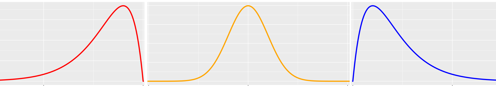

```{r setup, include=FALSE}
knitr::opts_chunk$set(echo = TRUE, comment = NA)
library(readr)
library(tidyverse)
library(DT)
library(paqueteMETODOS)

data("CarreraLuz22")
data("evaluacion")
data("inflacionov22")
```

</br>


Los indicadores de forma permiten adicionar elementos a la interpretación de los datos.

<br/><br/>

## <span style="color:#034a94">**Curtosis**</span>

Se mide a través del coeficiente de curtosis que mide cuan **puntiaguda** es una distribución respecto a un patrón estándar que es la curva de la distribución normal. Esta característica está relacionada directamente con la dispersión.

<br/><br/>

<div class="content-box-blue">
$$CA = \dfrac{1}{s^{4}}\Bigg(\dfrac{1}{n} \sum_{i=1}^{n} (x-\bar{x})^{4} \Bigg) - 3$$

</div>

<br/><br/>


De acuerdo con su valor, la puntudez de los datos puede clasificarse en tres grupos:

+ **Leptocúrtica**, con valores grandes para el coeficiente (CA>0)

+ **Mesocúrtica**, con valores medianos para el coeficiente (CA=0)

+ **Platicútrica**, con valores pequeños para el coeficiente (CA<0) 

</br>

<center>
```{r, echo=FALSE, fig.height=3, fig.width=9, message=FALSE, warning=FALSE}
# Distribucion normal
library(ggfortify)
p=ggdistribution(dnorm, seq(-5, 5, 0.01), mean = 0, sd = 1,colour = 'blue')
p=ggdistribution(dnorm, seq(-5, 5, 0.01), mean = 0, sd = .7,colour = 'red', p=p)
p=ggdistribution(dnorm, seq(-5, 5, 0.01),   mean = 0, sd = 1.5,colour = 'orange', p=p)
p 
```

**Figura 1.12** Comparación de las formas de curtosis
</center>

<br/> <br/>


### <span style="color:#FF7F00">**Ejemplo**</span>

<pre>
41.67, 42.23, 45.53, 50.82, 52.93, 57.03, 61.13, 62.48, 72.77, 75.58, 76.98, 78.05

coeficiente de curtosis = -1.674344
</pre>

```{r, eval=FALSE}
# install.packages("e1071")
library(e1071)
x= c(41.67, 42.23, 45.53, 50.82, 52.93, 57.03, 61.13, 62.48, 72.77, 75.58, 76.98, 78.05)
kurtosis(x)
```

El valor indica que los datos presentan una  forma platicurtica o aplanada


<br/><br/> 

## <span style="color:#034a94">**Asimetría o sesgo**</span>

<br/>

Mide que tanto la forma de la distribución de frecuencias de los datos es simétrica o no con respecto a la media. Esta característica de los datos se mide a través del coeficiente de asimetría o sesgo.

<div class="content-box-blue">
$$CA = \dfrac{1}{s^{4}}\Bigg(\dfrac{1}{n} \sum_{i=1}^{n} (x-\bar{x})^{4} \Bigg) - 3$$
</div>

+ Es **simétrica** si el  valor del indicador es 0  ($\bar{x}=Me$)

+ Es **asimétrica a la izquierda**> si el valor del indicador es negativo ($\bar{x}<Me$)

+ Es **asimétrica a la derecha** si el valor del indicador es positivo ($\bar{x}>Me$)

<br/>


<center> 
```{r, echo=FALSE, out.width="100%", fig.align = "center", message=FALSE, warning=FALSE}

```
**Figura 1.13** Comparación de las formas de sesgo o asimetrías
</center>

<br/>


### <span style="color:#034a94">**Interpretación**</span>

<br/>

+ **Asimetría negativa ** : Una prueba con resultados asimétricos a la izquierda o negativa, indica que pocos obtuvieron resultados bajos y que muchos alcanzaron resultados altos, pudiendo indicar que la prueba era relativamente fácil (poco con poco y mucho con mucho).

+ **Simétrica** : En este caso una prueba con resultados simétricos indica que los puntajes se ubicaron al rededor de la media y que unos pocos sacaron puntaje bajo y que los que presentaron resultados altos corresponden a un pequeño grupo. Por lo regular estos son los resultados de pruebas estandarizada como pueden ser las pruebas de estado (poco con poco y poco con mucho).

+ **Asimetría positiva**  :  Los resultados a pruebas con asimetría a la derecha o positiva, presentan resultados acumulados a la izquierda, es decir que muchos obtuvieron resultados bajos y unos pocos resultados altos. Esto haría pensar que la prueba fue exigente (mucho con poco y poco con mucho).

<br/><br/>

### <span style="color:#FF7F00">**Ejemplo**</span>


<pre>
41.67, 42.23, 45.53, 50.82, 52.93, 57.03, 61.13, 62.48, 72.77, 75.58, 76.98, 78.05

coeficiente de asimetría = 0.07062934
</pre>

```{r, eval=FALSE}
# install.packages("e1071")
library(e1071)
x= c(41.67, 42.23, 45.53, 50.82, 52.93, 57.03, 61.13, 62.48, 72.77, 75.58, 76.98, 78.05)
skewness(x)
```


