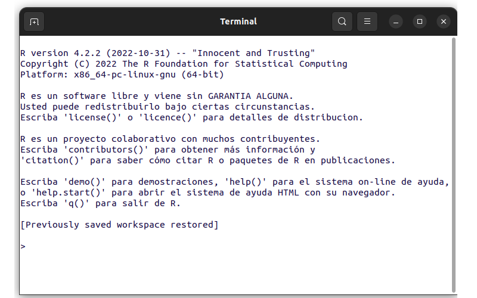

```{r setup, include=FALSE}
knitr::opts_chunk$set(echo = TRUE, message = FALSE, warning = FALSE, comment = NA)

```


<br/><br/>

```{r, echo=FALSE, out.width="10%", fig.align = "left"}
knitr::include_graphics("img/logoR.png")
```


<br/><br/>

# <span style="color:#034a94">**¿Qué es R?**</span> 

<br/>

Es un lenguaje para la computación  estadística, utilizado para el procesamiento de información y generación de modelos estadísticos. 

Entre las principales características  están:

+ Licencia (GNU GPL)  abierta y gratis

+ Creciente popularidad en ciencia de datos

+ Multipalataforma (Linux, Windows, MacOS)

+ Creado por los estadísticos Ross Ihaka y Robert Gentieman (U.Auckland - Nueva Zelanda) 1993 como [lenguaje para el anaisis de datos y gráficos](https://www.stat.auckland.ac.nz/~ihaka/downloads/R-paper.pdf)

+ Lenguaje multiparadigma

+ Codigo construido en C y Fortran

+ Gran comunidad muy activa 

+ Gran cantidad de librerías o packages (más de  18000) en su gran mayoría están almacenadas en [CRAN](https://cran.r-project.org/web/packages/available_packages_by_name.html), [Biocondictor](https://bioconductor.org/packages/release/BiocViews.html#___Software),  y otras almacenadas en github durante su proceso de construcción y ajustes

<br/><br/>


```{r, echo=FALSE, out.width="70%", fig.align = "center"}

```

<br/><br/><br/>

# <span style="color:#034a94">**¿Qué es RStudio?**</span>

```{r, echo=FALSE, out.width="20%", fig.align = "left"}
knitr::include_graphics("img/logoRStudio.png")
```

Esta interfaz o IDE que integra un conjunto de herramientas y ventanas  que facilitan el trabajo con R a sus usuarios 

Esta conformada por varias ventana como se muestra en la siguiente imagen:

<br/><br/>

```{r, echo=FALSE, out.width="100%", fig.align = "center"}
knitr::include_graphics("img/VRStudio.png")
```

<br/><br/>

1. Fuente (Source) : Ventana donde se trabajan los script  con código que se guardan para posterior utilización
2. Consola (Console) : Ventana donde se pueden escribir comandos de manera directa
3. Ambiente (Environment) : Ventana donde se pueden observar las variables y objetos creados
4. Archivos (Files) : Ventana que muestra el directorio y los archivos en el que estamos trabajando
5. Graficos (plots) : Ventana que presenta los gráficos construidos
6. Paquetes (Packages) : Ventana que permite instalar los paquetes requeridos
7. Ayudas (Help) : Ventana en la que podemos pedir ayuda sobre las sintaxis de funciones


<br/><br/>

En los siguientes enlaces se pueden descargar los programas para su instalación :

+ [R download](https://cran.r-project.org/)

+ [RStudio download](https://rstudio.com/products/rstudio/download/)

<div class="content-box-gray">
### <span style="color:#686868">**Nota**</span>  

Antes de instalar RStudio se recomienda instalar los siguientes programas 

+ git
+ Miktex (Win) o Texlife (Linux), dependiendo el sistema operativo 
+ un visor de pdf en caso de no tenerlos
+ Python

Estos programas se insertan dentro de la configuración inicial al instalar posteriormente RStudio y serán de gran utilidad al procesar informes mediante archivos Rmd

</div>

<br/>

R cuenta con una ventana de ayudas que permite revisar las sintaxis y detalles de sus parámetros, al igual que ejemplos y artículos relacionados con las funciones consultadas

Para ascender a las ayudas se puede consultar directamente en la venta Help  o desde la linea de la Consola:

<pre>
help("lm")
</pre>


<pre>
?"lm"
</pre>


A continuación se realiza un resumen de las principales funciones empleadas en esta unidad

